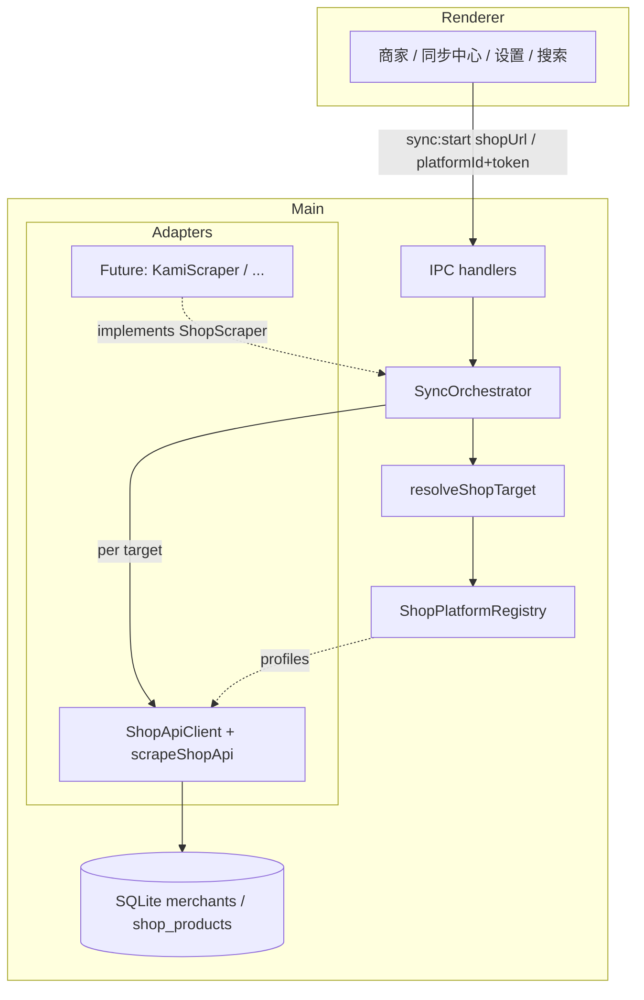
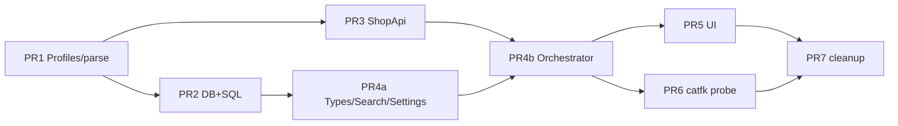

# 多平台店铺深刮：Platform Adapter 架构与 catfk.com 接入

| 字段 | 内容 |
|---|---|
| **文档标题** | Multi-platform Shop Scrape — Platform Adapters + catfk.com |
| **作者** | Merchant Aggregator contributors |
| **日期** | 2026-07-17 |
| **状态** | Draft（修订 R2 — 回应 re-review minor/nit） |
| **仓库** | `/Users/zhouhuang/Documents/myCode/merchant-aggregator` |
| **关联文档** | `docs/ldxp-merchant-scrape-plan.md`、`docs/product-design.md` |
| **实现状态** | **先落档，后接入** — 本文仅设计；实施按文末 PR Plan 分批落地 |

---

## Overview

当前桌面端仅支持链动小铺（`pay.ldxp.cn` / platform id `ldxp`）深刮：从 URL 解析、HTTP 客户端、`shop_products` 写入、同步任务类型、商家表 `ldxp_token` 列到 UI 文案，全部硬编码为 ldxp。用户需要支持同类发卡网店铺 URL（首例：`https://catfk.com/shop/hththt`），并保证后续再接入 kami / dujiao 等平台时**不靠 `if (host === 'catfk.com')` 补丁**，而是走可注册的平台适配层。

本文提出：引入 **`ShopSiteProfile` 注册表 + shopApi 族参数化客户端**，将现有 `LdxpClient` / `scrapeLdxpShop` 提炼为共享 `ShopApiClient` + `scrapeShopApi`；用 **`shop_platform` + `shop_token`** 取代「仅 `ldxp_token` 判定可刮」；同步 job 收敛为 `shop_*`（短期兼容 `ldxp_*` 别名）；支持**无 PriceAI 商家行**的纯 URL 手动深刮。catfk 在 HTML 壳与资源路径上与 ldxp 同构，按 **shopApi-family 站点配置**接入；若实测 API 路径或字段分叉，再在 profile 层覆盖，不重写主循环。

**R1 补强重点**：SearchHit/Favorites 必须暴露 `platformId`/`source`，刷新路径禁止 token-only；PR2 **强制**切换可刮 SQL；settings 读写 dual-key；job 入库前 normalize + `lastSuccessAt` 别名合并；orphan 商品 re-scrape/re-link 生命周期；PR4 拆分为 4a/4b；`ShopSiteProfile` 含 `enabled`/`endpoints`/`probeStatus`。

**R2 补强**：`CATFK_PROFILE.enabled=false` 直至 PR6 冒烟；disabled 队列 **skip** vs 显式 `shop_one` **PAUSED**；商品刷新禁止把 `source_url`（常为 `/item/`）当 shopUrl；PriceAI derive-null **保留**已有 `shop_*`；收藏批量刷新规则。

---

## Background & Motivation

### 现状：ldxp 硬编码渗透全栈

| 区域 | 关键路径 | 耦合表现 |
|---|---|---|
| URL 解析 | `src/shared/lib/url-parse.ts` | `parseLdxpShopToken` 只返回 token，**且任意 host 的 `/shop/:token` 都抽 token**（过宽） |
| HTTP 客户端 | `src/main/platforms/ldxp/client.ts` | `baseUrl = 'https://pay.ldxp.cn'` 写死 |
| 刮取引擎 | `src/main/platforms/ldxp/scraper.ts` | `source: 'ldxp'`、`id = ldxp:{token}:{key}`、item URL 硬编码 `pay.ldxp.cn` |
| 同步编排 | `src/main/services/sync-orchestrator.ts` | Lane `'ldxp'`；job `ldxp_shop\|ldxp_selected\|ldxp_all`；开关 `ldxpScrapeEnabled` |
| 商家仓储 | `src/main/db/repositories/merchants-repo.ts` | 可刮条件 = `ldxp_token IS NOT NULL`；`listLdxp*` / `countLdxp` / `candidatesForQuery` |
| PriceAI 归一 | `src/main/platforms/priceai/normalize.ts` | `deriveLdxpToken` **先** `parseLdxpShopToken(shopUrl)`，**任意 host 的 shop path 都会写入 `ldxp_token`**（错误平台归因 bug，见下） |
| 设置 | `src/shared/types/settings.ts` + constants | `ldxpMinIntervalMs` / `ldxpScrapeEnabled`；`RATE_LIMITS.ldxpMinIntervalMs`；allowlist 无 catfk |
| UI | MerchantsPage / SyncCenterPage / Settings / Favorites | 「仅 ldxp」；收藏外链拼 `pay.ldxp.cn`；刷新店 `token` only |
| 搜索命中 | `SearchService` → `SearchHit.ldxpToken` / `ldxpGoodsKey` | **表级**已读 `shop_products`（多源就绪），但 **IPC 字段名仍 ldxp 绑定**，且 **未 select `s.source`** |

### 已具备的可扩展基础

- `shop_products.source` TEXT + `UNIQUE (source, source_shop_token, source_goods_key)` — 物理层已按源隔离。
- SearchService **查询路径**只读 `shop_products`、不 import 网络（K23）；但 hit 映射与 favorites 仍按 ldxp 命名/硬编码 URL，**不是**完整多源展示契约。
- `merchant_id` 可空 — 允许「无商家主档」的店内商品入库。
- 限速 / CookieJar / WAF 检测（`isLdxpChallengeResponse`）/ NEED_BROWSER 错误码 — 可提升为 family 共享能力。

### 用户痛点与既有 bug

1. 直接打开 `https://catfk.com/shop/hththt` 无法正确按平台刮取与入库搜索。
2. **现网 bug（比「提不到 token」更严重）**：`parseLdxpShopToken` 对任意 host 抽 token，`deriveLdxpToken` 在 host 校验前就 `return fromShop`。因此若 PriceAI（或手工）出现 `shopUrl=https://catfk.com/shop/hththt`，**今天就会把 `hththt` 写入 `ldxp_token`，随后对 `pay.ldxp.cn` 误刮**。多平台改造必须把此当作 **错误平台归因 bugfix**，而非仅「扩展支持」。
3. 搜索「刷新店铺」仅传 `token`（默认 ldxp）；catfk 商品入库后若无 `platformId`，刷新会打错站。
4. 继续在 `LdxpClient` 内打 host 补丁会锁死架构。

### catfk 调研结论（2026-07-17）

| 项 | 结论 |
|---|---|
| URL 形态 | `https://catfk.com/shop/{token}`，样本 token `hththt` |
| 前端壳 | Vue 3 + Arco SPA，loading spinner；`/package/shop/assets/index.<hash>.js` — **与 ldxp 同构** |
| Session | `Set-Cookie: PHPSESSID=...` |
| TLS | CN=`catfk.com`（宝塔 DV） |
| 风控 | 首次 HTML 可取；后续 API 探测易出现 empty reply / 连接被关 — 须按 **NETWORK / NEED_BROWSER** 处理（对标 ldxp ESA 路径） |
| 假设 | catfk 为同一发卡网 shopApi 软件白标/换皮；**优先参数化 baseUrl + hosts**，非整套重写 |
| **API 固化状态（R1/R2）** | **截至设计修订，`Shop/info` / `goodsList` 未在可靠环境固化样例**；HTML 壳同构仅支持「同族假设」。**合入以 PR6 冒烟为准**；默认 `enabled:false` 直至冒烟通过 |

---

## Goals & Non-Goals

### Goals

1. **平台适配架构**：以注册表 + family 驱动替换 ldxp-only 管线；现有 ldxp 用户数据零损失、零手动迁移。
2. **接入 catfk**：作为第二平台；默认 shopApi-family 配置；API 实测分叉时仅改 profile/adapter，不改 orchestrator 主循环。
3. **URL → 平台解析**：任意**已注册** host 的 shop/item URL → `{ platformId, token, baseUrl, profile }`；path token **仅在 host 命中 profile 时**接受。
4. **商家模型演进**：可刮判定从 `ldxp_token` **强制**迁到 `shop_platform` + `shop_token`（PR2 完成 SQL/健康度切换）。
5. **同步 job 演进**：canonical `shop_*` + 一轮 `ldxp_*` 别名；入库前 normalize；lane `'shop'`。
6. **手动 URL 深刮**：即使不在 PriceAI 商家表，也可刮指定店铺 URL 并写入 `shop_products`（`merchant_id` 可空）；orphan 可 re-scrape。
7. **设置 / allowlist**：读写 dual-key；默认 allowlist 含 `catfk.com`；bootstrap 与 scrape 开关交互明确。
8. **DB migration**：`DB_SCHEMA_VERSION` 递增至 4。
9. **可实施 PR Plan**：PR4 拆分；SearchService/Favorites 有明确交付物。
10. **拒绝补丁式**：禁止 host-if / `profile.id === 'catfk'` 散落分支；profile 单源。

### Non-Goals

- 本阶段不实现 kami / dujiao 具体适配（只预留 family / registry 插槽）。
- 不调用下单 / 支付 / 上传等写接口。
- 不做验证码打码、代理池、静默绕过 WAF。
- 不改变「搜索只读本地 SQLite、同步用户显式触发」产品约束（product-design K23）。
- 不做云同步 / 多用户。
- **不做**「关联商家」手工 UI（orphan → merchant 仅靠刮取匹配 + SQL backfill）。
- 本设计文档阶段**不写业务代码**（落档优先）。

---

## Key Decisions

| # | 决策 | 选择 | 简要理由 |
|---|---|---|---|
| D1 | 适配分层 | **Registry（`ShopSiteProfile`）+ Family Adapter（`shopapi`）** | catfk≈ldxp 同软件族；差异收敛为配置，非 per-host 分支 |
| D2 | 客户端形态 | 将 `LdxpClient` **提炼为** `ShopApiClient(profile)`；ldxp 仅保留 thin re-export 或删除 | 禁止 host if / `profile.id` 硬分支；参数化 baseUrl/Origin/Referer/item URL/endpoints |
| D3 | 商家可刮字段 | 新增 `shop_platform` + `shop_token`；**PR2 强制**所有可刮 SQL/健康度切到这两列；`ldxp_token` 仅当 `platform==='ldxp'` dual-write | 可刮 = 两字段非空；禁止把 catfk token 写入 `ldxp_token` |
| D4 | 产品 identity | `shop_products.id = {sourceId}:{token}:{goods_key}`；`source = profile.sourceId` | UNIQUE 与 search 兼容；分平台 id 空间 |
| D5 | Sync job 类型 | Canonical `shop_one` / `shop_selected` / `shop_all`；`ldxp_*` 别名；**insert 前 normalize 为 canonical**；进度事件带 canonical + `requestedJobType` | 存储一致；历史别名行通过 lastSuccessAt 合并读取 |
| D6 | Lane | `'ldxp'` → **`'shop'`**（单 lane 串行） | WAF 友好；priceai lane 不变 |
| D7 | 手动 URL | `SyncStartRequest.shopUrl` → `shop_one`；**绝不**把用户 URL 当 fetch 根地址 | 只 parse → `profile.baseUrl` + path |
| D8 | 设置读写 | **get 时 coalesce**；**set 时 dual-write** 新旧键同值 ≥1 版 | 避免半迁移磁盘状态 |
| D9 | catfk 验证 | **默认 `CATFK_PROFILE.enabled=false`** + `probeStatus:'unverified'`，直至 PR6 冒烟通过后改 `true`/`ok`；parse 仍识别 hosts | 架构可先合；避免未验证 API 被批量/粘贴刮 |
| D10 | Search/Favorites 平台字段 | **必填** `platformId`（= `shop_products.source`）+ `shopToken`；废弃别名 dual-fill；**刷新禁止 token-only**；**禁止**把商品 `source_url`（常为 `/item/`）当 `shopUrl` | 防误刮与 INVALID_URL footgun |
| D11 | 非 shopApi | `ShopScraper` 接口 | orchestrator 不绑 HTTP JSON |
| D12 | 合成商家 | **不**自动建 merchants；orphan `merchant_id=null` | PriceAI 为商家 SoT |
| D13 | Job 存储 | **始终存 canonical** `shop_*`；请求别名记入 `meta.requestedJobType` | lastSuccessAt / 过滤一致 |
| D14 | Orphan re-link | 刮取命中商家时 upsert 写 `merchant_id`；成功后 **one-shot** `UPDATE ... SET merchant_id WHERE source+token AND merchant_id IS NULL` | 无手工关联 UI |
| D15 | Profile.enabled 分流 | `enabled===false`：parse 仍可识别；**批量队列（shop_all / bootstrap / listScrapable\*）过滤跳过**（meta 计数）；**显式 `shop_one`（含粘贴 URL）→ `PAUSED`**，不发起 HTTP | 批量不 partial-fail；显式操作给明确反馈 |
| D16 | shop_all 范围 | **仅** merchants 上 `shop_*` 非空 **且** `getProfile(platform).enabled===true` 的行；不含 orphan-only token | 与 D15 一致 |
| D17 | Bootstrap × 开关 | `shopScrapeEnabled=false` 时：`bootstrap` **允许** merchants，**跳过**深刮并 success 附 meta；纯 `shop_*` **整单** `PAUSED` | 不阻断商家同步 |
| D18 | Profile 单源 | **唯一** `src/shared/platforms/shop-profiles.ts`；main re-export + scraper | 防 hosts 漂移 |
| D19 | PriceAI derive-null | `deriveShopRef` **非 null** → 按 D3 写三列；**null → 保留**库内已有 `shop_platform`/`shop_token`/`ldxp_token`（不因缺 URL 清空可刮性） | 防 PriceAI 字段抖动导致 un-scrapable |
| D20 | 商品刷新载荷 | 唯一规范：`shop_one` + `{ platformId, token }`（+ 可选 merchantId）；需要 URL 时用 registry **`shopUrl(profile, token)` 店根**，**永不** `hit.sourceUrl`（item 链） | 消除 §10 footgun |

---

## Proposed Design

### 1. 总体架构



### 2. 目录与模块边界（单源 profile）

```text
src/shared/platforms/
  shop-profiles.ts         # ★ 唯一真源：全部 ShopSiteProfile 字面量（无 Node API）
  shop-types.ts            # ShopSiteProfile, ShopFamily, ShopApiEndpoints（shared 可 import）
src/shared/lib/
  url-parse.ts             # parseShopUrl(input, profiles) / parseLdxpShopToken 兼容
src/main/platforms/
  registry.ts              # re-export profiles；getProfile / profileByHost / scraperFor / enabledProfiles
  types.ts                 # ShopScrapeTarget, ShopScraper（运行时）
  shopapi/
    client.ts              # ShopApiClient(profile)
    scraper.ts
    challenge.ts
  ldxp/                    # 过渡 re-export
  priceai/                 # deriveShopRef
```

**原则**：

- **禁止**第二份 host 表。shared 与 main 共用 `SHOP_PROFILES` 数组；单测可 `expect(mainHosts).toEqual(sharedHosts)`。
- `parseShopUrl` 接受 `profiles` 参数，默认调用方传入 `SHOP_PROFILES`（或 `enabled` 过滤后的列表——见 D15：parse 使用**全部已注册** profile，含 disabled，以便识别「已知但未启用」）。
- HTTP 仅 main。

**反补丁约定（PR3 checklist）**：

- `ShopApiClient` / `scrapeShopApi` 内 **零** `profile.id === '...'` / 字面量 `catfk.com`（除通过 `profile.*` 读取）。
- 可选：eslint `no-restricted-syntax` 限制 `catfk.com` 字符串仅出现在 `shop-profiles.ts`。

### 3. 核心类型（完整）

```ts
export type ShopFamily = 'shopapi' // | 'kami' | 'dujiao'

export interface ShopApiEndpoints {
  info: string       // default '/shopApi/Shop/info'
  goodsList: string  // default '/shopApi/Shop/goodsList'
}

export type ShopProbeStatus = 'unverified' | 'ok' | 'degraded' | 'blocked'

export interface ShopSiteProfile {
  id: string
  displayName: string
  family: ShopFamily
  hosts: readonly string[]
  baseUrl: string
  /** 默认 `/shop/${token}` */
  shopPathTemplate: string
  /** 默认 `${baseUrl}/item/${goodsKey}`；实现可用 helper */
  itemPathTemplate: string
  sourceId: string
  defaultGoodsTypes: readonly string[]
  defaultMinIntervalMs: number
  /** 默认 true；false = 可识别不可刮（D15） */
  enabled: boolean
  /** 覆盖默认 shopApi 路径；省略则用 DEFAULT_SHOPAPI_ENDPOINTS */
  endpoints?: ShopApiEndpoints
  /** 文档/诊断用；不替代 enabled */
  probeStatus?: ShopProbeStatus
}

export const DEFAULT_SHOPAPI_ENDPOINTS: ShopApiEndpoints = {
  info: '/shopApi/Shop/info',
  goodsList: '/shopApi/Shop/goodsList'
}

export interface ShopRef {
  platformId: string
  token: string
  baseUrl: string
  shopUrl: string
  profile: ShopSiteProfile
}

export interface ShopScrapeTarget {
  platformId: string
  token: string
  merchantId: string | null
  label?: string
}

export interface ShopScraper {
  scrape(opts: {
    target: ShopScrapeTarget
    minIntervalMs: number
    signal?: AbortSignal
    onProgress?: (p: { current: number; total: number; phase: string }) => void
  }): Promise<{
    rows: NormalizedShopProductRow[]
    shopName: string | null
    goodsCount: number
  }>
}
```

#### 首批 profile

```ts
export const LDXP_PROFILE: ShopSiteProfile = {
  id: 'ldxp',
  displayName: '链动小铺',
  family: 'shopapi',
  hosts: ['pay.ldxp.cn', 'ldxp.cn', 'www.ldxp.cn'],
  baseUrl: 'https://pay.ldxp.cn',
  shopPathTemplate: '/shop/{token}',
  itemPathTemplate: '/item/{goodsKey}',
  sourceId: 'ldxp',
  defaultGoodsTypes: ['card', 'article', 'resource', 'equity'],
  defaultMinIntervalMs: 500,
  enabled: true,
  probeStatus: 'ok'
}

export const CATFK_PROFILE: ShopSiteProfile = {
  id: 'catfk',
  displayName: 'catfk',
  family: 'shopapi',
  hosts: ['catfk.com', 'www.catfk.com'],
  baseUrl: 'https://catfk.com',
  shopPathTemplate: '/shop/{token}',
  itemPathTemplate: '/item/{goodsKey}',
  sourceId: 'catfk',
  defaultGoodsTypes: ['card', 'article', 'resource', 'equity'],
  defaultMinIntervalMs: 500,
  /**
   * D9/D15：默认 false，直至 PR6 冒烟通过后改为 true。
   * parseShopUrl 使用全部注册 profiles（含 disabled），故 false 不影响识别 host。
   */
  enabled: false,
  probeStatus: 'unverified'
}

export const SHOP_PROFILES: readonly ShopSiteProfile[] = [LDXP_PROFILE, CATFK_PROFILE]
```

Helper（main 或 shared）：

```ts
function shopUrl(p: ShopSiteProfile, token: string): string {
  return `${p.baseUrl}${p.shopPathTemplate.replace('{token}', token)}`
}
function itemUrl(p: ShopSiteProfile, goodsKey: string): string {
  return `${p.baseUrl}${p.itemPathTemplate.replace('{goodsKey}', goodsKey)}`
}
```

`qn.ldxp.cn` 等 CDN **不**进 scrape registry（仅 open-external allowlist）。

### 4. URL → 平台解析（绝对规则）

```ts
const SHOP_PATH = /\/shop\/([A-Za-z0-9]+)/i
const ITEM_PATH = /\/item\/([A-Za-z0-9]+)/i
const TOKEN_ONLY = /^[A-Za-z0-9]{6,16}$/

/**
 * 绝对规则：
 * 1) 完整 URL：hostname 必须 ∈ profiles.hosts，才接受 path 中的 token
 * 2) path-only `/shop/xxx`：无 host → null
 * 3) bare token：→ null（platform 由调用方显式提供，不在解析器里默认 ldxp）
 */
export function parseShopUrl(
  input: string,
  profiles: readonly Pick<ShopSiteProfile, 'id' | 'hosts' | 'baseUrl' | 'enabled'>[]
): { platformId: string; token: string; baseUrl: string; profileEnabled: boolean } | null

/** 兼容：完整 ldxp URL 或 bare token → token 字符串；任意非 ldxp host 的 /shop/ 不得再当 ldxp */
export function parseLdxpShopToken(input: string | null | undefined): string | null {
  // 委托：仅 platformId==='ldxp' 的 parseShopUrl 结果，或 TOKEN_ONLY bare（历史行为保留给旧调用）
}
```

#### 单测向量（PR1 退出标准）

| 输入 | 期望 |
|---|---|
| `https://catfk.com/shop/hththt` | `{ platformId:'catfk', token:'hththt' }` |
| `https://pay.ldxp.cn/shop/EXZMM8SQ` | `{ platformId:'ldxp', token:'EXZMM8SQ' }` |
| `https://evil.example/shop/ABC` | `null`（host 未注册） |
| `/shop/hththt` | `null` |
| `hththt`（bare） | `parseShopUrl` → `null`；`parseLdxpShopToken` → `'hththt'`（兼容） |
| `https://catfk.com/shop/hththt` 经旧 `deriveLdxpToken` | **禁止**再写入 `ldxp_token`（PR2 `deriveShopRef` 回归） |

#### `resolveShopTarget`（orchestrator 纯函数）

```ts
export type ResolveShopInput = {
  merchantId?: string
  token?: string
  platformId?: string
  shopUrl?: string
}

export type ResolveShopResult =
  | { ok: true; target: ShopScrapeTarget; profile: ShopSiteProfile }
  | { ok: false; code: 'NOT_FOUND' | 'INVALID_URL' | 'PAUSED'; message: string }

/**
 * 优先级（严格）：
 * 1) shopUrl → parseShopUrl(全部注册 profiles)
 *    - null → INVALID_URL
 *    - profile.enabled===false → PAUSED（「平台暂未启用深刮」）
 * 2) platformId + token → getProfile；无 profile → NOT_FOUND；disabled → PAUSED
 * 3) merchantId → DB shop_platform+shop_token；若缺则 fallback parseShopUrl(shop_url|entry_url)
 *    并 lazy backfill shop_*（仅当 parse 成功且 enabled）
 * 4) 仅 token、无 platformId（旧 IPC）→ 默认 platformId='ldxp'（兼容）；
 *    **多平台 UI 禁止走此分支**（Search/Favorites 必须带 platformId）
 */
export function resolveShopTarget(
  input: ResolveShopInput,
  deps: { getMerchant; getProfile; parseShopUrl }
): ResolveShopResult
```

#### resolve 用例表

| # | 输入 | 结果 |
|---|---|---|
| 1 | `shopUrl=https://catfk.com/shop/hththt` | catfk + hththt；查 merchant 可选关联 |
| 2 | `platformId=catfk, token=hththt` | 同上，不依赖 URL |
| 3 | `merchantId` 且行有 shop_* | 用行上 platform+token |
| 4 | `token=EXZMM8SQ` only（旧 UI） | **ldxp** + token（兼容） |
| 5 | `token=hththt` only 且本意 catfk | **错误默认 ldxp** — 故 Search 必须传 platformId |
| 6 | `shopUrl` host 未注册 | INVALID_URL |
| 7 | catfk `enabled:false` | PAUSED，不发起 HTTP |

```mermaid
sequenceDiagram
  participant UI
  participant Orch as SyncOrchestrator
  participant Reg as Registry
  participant DB
  participant Scraper as ShopApiScraper

  UI->>Orch: sync:start { jobType: shop_one, shopUrl }
  Note over Orch: normalizeJobType → shop_one; insert canonical
  Orch->>Reg: parseShopUrl(shopUrl)
  Reg-->>Orch: ShopRef{catfk, hththt}
  Orch->>DB: match merchant by platform+token
  Orch->>Scraper: scrape(target) per-instance client
  Scraper-->>Orch: rows source=catfk
  Orch->>DB: upsertMany; optional re-link orphans
```

### 5. ShopApi 族客户端

| 原硬编码 | 参数化来源 |
|---|---|
| `baseUrl` | `profile.baseUrl` |
| Origin / Referer | `profile.baseUrl` + shopPath |
| API path | `profile.endpoints ?? DEFAULT_SHOPAPI_ENDPOINTS` |
| item fallback URL | `itemUrl(profile, key)` |
| source / 行 id | `profile.sourceId` |

**实例生命周期**：每个 `scrape()` **新建** `ShopApiClient`（Cookie jar 不跨 host / 不跨店共享）——与现 ldxp 每店 `new LdxpClient` 一致。

**错误映射（对齐并修正文档）**：

| 场景 | code | 说明 |
|---|---|---|
| fetch throw / 连接重置 / empty reply at socket | `NETWORK` | |
| 挑战 HTML（原 isLdxpChallengeResponse） | `NEED_BROWSER` | |
| HTTP 200 但 **body 空** 或非 JSON | **`NETWORK`**（R1 调整） | 用户侧与 WAF/空响应同类；细节放 `details.snippet`；旧实现 SCHEMA_VALIDATION 改为更可操作的 UX |
| JSON 可解析但 `code !== 1` | `NETWORK`（msg） | 与现逻辑一致 |
| 429 | 非 NEED_BROWSER；上层可重试文案 | |

Warmup：非 challenge 失败 **继续**（保持现行为）。

### 6. Registry 与 Scraper 选择

```ts
export function getProfile(id: string): ShopSiteProfile | undefined
export function profileByHost(host: string): ShopSiteProfile | undefined
export function allRegisteredHosts(): string[]
export function scrapableProfiles(): ShopSiteProfile[] // enabled===true

export function scraperFor(profile: ShopSiteProfile): ShopScraper {
  if (!profile.enabled) {
    throw new AppError('PAUSED', `platform ${profile.id} scrape disabled`)
  }
  switch (profile.family) {
    case 'shopapi':
      return createShopApiScraper(profile)
    default:
      throw new AppError('INTERNAL', `no scraper for family ${profile.family}`)
  }
}
```

### 7. 同步编排演进

#### 7.1 Job 类型与 normalize

```ts
export const SHOP_JOB_ALIASES: Record<string, 'shop_one' | 'shop_selected' | 'shop_all'> = {
  shop_one: 'shop_one',
  shop_selected: 'shop_selected',
  shop_all: 'shop_all',
  ldxp_shop: 'shop_one',
  ldxp_selected: 'shop_selected',
  ldxp_all: 'shop_all'
}

export function normalizeJobType(t: SyncJobType): SyncJobType {
  return (SHOP_JOB_ALIASES[t] as SyncJobType) ?? t
}

export function isShopJob(t: SyncJobType): boolean {
  const c = normalizeJobType(t)
  return c === 'shop_one' || c === 'shop_selected' || c === 'shop_all'
}
```

| Canonical | 兼容别名 | 含义 |
|---|---|---|
| `shop_one` | `ldxp_shop` | 单店 |
| `shop_selected` | `ldxp_selected` | 多选商家 id |
| `shop_all` | `ldxp_all` | merchants 上全部 scrapable；`force` 忽略新鲜期 |
| `merchants` | — | PriceAI |
| `bootstrap` | — | merchants + Top-N scrapable |

**存储规则（D13）**：

1. `start()` 入口：`const requested = req.jobType`；`const jobType = normalizeJobType(requested)`。
2. **`sync_jobs.insert` 写入 `jobType`（canonical）**；`meta: { requestedJobType: requested, ... }`。
3. 内存 running / lane / runJob 一律用 canonical。
4. **进度事件**：`jobType` = **canonical**；另带 `requestedJobType?:`（可选字段，便于 UI 显示「来自旧入口」）。Renderer 应用 `normalizeJobType` 或 labels 双 key。

**`lastSuccessAt` 合并（SyncJobsRepo 或 orchestrator.getStatus）**：

```ts
// 读出 GROUP BY job_type 后：
// lastSuccessAt.shop_all = max(shop_all, ldxp_all)
// lastSuccessAt.shop_one = max(shop_one, ldxp_shop)
// lastSuccessAt.shop_selected = max(shop_selected, ldxp_selected)
// 同时保留旧 key 指向同一时间戳一版，避免旧 UI 空白
```

#### 7.2 Lane

```ts
type Lane = 'priceai' | 'shop'
// merchants → priceai
// bootstrap → priceai + shop
// isShopJob → shop
```

#### 7.3 目标构建与队列（D15/D16）

**批量目标过滤**（`shop_all` / `bootstrap` Top-N / `listScrapable*` 消费方）：

```ts
// merchants 已满足 SCRAPABLE_SQL 后：
const targets = rows
  .map(...)
  .filter((t) => getProfile(t.platformId)?.enabled === true)
// 被滤掉的 disabled 平台：不入队、不记 per-item failed
// meta: { skippedDisabledPlatform: n, skippedDisabledPlatformIds: ['catfk', ...] }
```

- **不**对批量队列中的 disabled 行抛 PAUSED partial（避免「全失败」误报）。
- **显式** `shop_one`（`shopUrl` / `platformId+token` / 仅 merchant 但 platform disabled）：`resolveShopTarget` → **`PAUSED`**（「平台暂未启用深刮」），**不**发 HTTP。

`runShopQueue(targets: ShopScrapeTarget[])`：

- 调用方保证 targets 已是 enabled（或再防御性 `scraperFor`）
- 每个 target：`scraperFor` → scrape → `shopProducts.upsertMany`
- 健康度：有 `merchantId` → `setAppHealth`；否则 `setAppHealthByShopRef(platform, token)` **仅更新匹配行**（无行则 noop）
- **禁止** `setAppHealthByToken(token)` 无 platform（跨平台 token 碰撞）

#### 7.4 设置门闸（D17）

```ts
// 纯 shop job
if (isShopJob(jobType) && !settings.shopScrapeEnabled) {
  throw new AppError('PAUSED', 'shop scrape disabled in settings')
}

// bootstrap
if (jobType === 'bootstrap' && !settings.shopScrapeEnabled) {
  // 仍跑 fetchMerchantsPhase；深刮 targets=[]；finishSuccess
  // message: 'merchants ok; shop scrape skipped (disabled)'
  // meta: { shopScrapeSkipped: true }
}
```

`networkPaused` 仍全局拦截（现有行为）。

### 8. 手动 URL 深刮与 Orphan 生命周期

| 步骤 | 行为 |
|---|---|
| UI | 同步中心「从店铺 URL 同步」；`sync.start({ jobType:'shop_one', shopUrl })` |
| 解析 | `parseShopUrl`；未注册 host → INVALID_URL；disabled → PAUSED |
| 商家关联 | `WHERE shop_platform=? AND shop_token=?`；命中则带 merchantId |
| 入库 | `merchant_id` 可空；`source=profile.sourceId` |
| **Re-scrape orphan** | Search/Favorites：**始终** `shop_one` + `{ platformId, token }`（来自 hit/favorite 字段），**不要求** merchantId |
| **Re-link** | 若本次 scrape 带上 merchantId：upsert 写 `merchant_id`；并执行 one-shot：`UPDATE shop_products SET merchant_id=? WHERE source=? AND source_shop_token=? AND (merchant_id IS NULL OR merchant_id='')`（D14：**采用 yes**） |
| 健康度 | 无 merchant 行则跳过 health 更新 |
| 搜索分 | orphan LEFT JOIN 无 merchant → health 视作 n/a → **无 healthy +10 分**（文档明确；可接受） |
| 非目标 | 无「关联商家」手工 UI |

**Favorites / Recent 外链**：

1. 优先 `source_url`（DB 已有）。
2. 否则 `platformId/source` + `source_goods_key` → registry `itemUrl`。
3. 解析 `target_id` 形如 `ldxp:token:key` / `catfk:token:key` 时 **按第一段 platform**，禁止写死 pay.ldxp.cn。

**「刷新收藏的店」**（单条）：条件改为 `platformId && shopToken`，**去掉**对 `merchantId` 的硬依赖；载荷见 D20 / §10（**不要**用商品 `source_url` 当 shopUrl）。

**批量「刷新收藏的店」**（PR5，v1）：

1. 从选中 favorites 收集 `{ platformId, shopToken, merchantId? }`，**按 `(platformId, shopToken)` 去重**。
2. **每个** unique 对串行或排队发起 `shop_one`（可共用现有 shop lane 互斥：一次只跑一个 job 时则顺序 `start` 或扩展为单 job 多 target——v1 允许 N 次 `shop_one`，UX 可 toast「将刷新 N 家店」）。
3. **不**要求全部有 `merchantId`（orphan 可刷）。
4. 可选优化（非 v1 必须）：当**全部**目标都有 `merchantId` 时，可走 `shop_selected` + `merchantIds`；混合 orphan/多平台时 **不要**只丢 orphan。
5. **不**新增 job 类型。

### 9. PriceAI normalize — bugfix + 扩展

```ts
/** 取代 deriveLdxpToken — 修复「任意 /shop/ 写入 ldxp_token」 */
export function deriveShopRef(input: {
  host?: string | null
  shopUrl?: string | null
  entryUrl?: string | null
}): { platformId: string; token: string } | null {
  // 仅 parseShopUrl(shopUrl|entryUrl, SHOP_PROFILES)；host 必须匹配
  // 禁止：先抽 token 再看 host
}
```

#### 写入规则（D3 + **D19 规范，唯一**）

| 条件 | `shop_platform` / `shop_token` | `ldxp_token` |
|---|---|---|
| `deriveShopRef` → `{ platformId, token }` | 写入该对 | `platformId === 'ldxp' ? token : null`（catfk 等非 ldxp **必须** null） |
| `deriveShopRef` → `null` | **保留**库内已有值，**不**用 null 覆盖 | **保留**已有值 |

实现方式（PR2 二选一，行为等价即可）：

1. **应用层 merge**（推荐）：`upsertMany` 前 `getById` 或批量读旧行，derive null 时把旧 `shop_*`/`ldxp_token` 填回 normalize 结果；或  
2. **SQL**：`ON CONFLICT DO UPDATE SET shop_platform = COALESCE(excluded.shop_platform, merchants.shop_platform), ...` 仅对这三列；**注意** derive 出 catfk 时 `ldxp_token` 必须主动写 null（不能 COALESCE 保留旧 ldxp token）——故 **非 null derive 走整列覆盖；null derive 三列 COALESCE** 更精确：

```sql
-- 示意：仅 shop 三列；其它 PriceAI 字段仍 excluded 覆盖
shop_platform = CASE
  WHEN excluded.shop_platform IS NOT NULL THEN excluded.shop_platform
  ELSE merchants.shop_platform END,
shop_token = CASE
  WHEN excluded.shop_token IS NOT NULL THEN excluded.shop_token
  ELSE merchants.shop_token END,
ldxp_token = CASE
  WHEN excluded.shop_platform IS NOT NULL THEN excluded.ldxp_token  -- 含显式 null（非 ldxp）
  ELSE merchants.ldxp_token END
```

应用层更易读：**derive 非 null** 时 normalize 带齐三列（含非 ldxp 的 `ldxp_token: null`）并覆盖；**derive null** 时 normalize 对三列输出「哨兵省略」/不传，merge 旧值。

**刻意清空**可刮字段：本设计 **out of scope**（无 UI/API）。

**回归向量（PR2）**：

1. `shopUrl=https://catfk.com/shop/hththt` → `{platformId:'catfk', token:'hththt'}`，`ldxp_token === null`，`shop_token === 'hththt'`。  
2. 已有 ldxp token 的行，PriceAI 刷新缺 shopUrl 且 derive null → **token 仍在**，`countScrapable` 不降。

### 10. SearchService / Favorites 字段契约（阻塞项）

#### SearchService（PR4a 交付）

`SHOP_SELECT` **必须**包含 `s.source`：

```sql
SELECT s.id, s.title, s.shop_name, s.merchant_id, m.name AS merchant_name,
  CASE
    WHEN m.shop_token IS NULL OR m.shop_token = '' THEN 'n/a'
    WHEN m.app_health_status IS NULL OR m.app_health_status = '' THEN 'never'
    ELSE m.app_health_status
  END AS merchant_health,
  s.price, s.currency, s.stock,
  s.source_url, s.source_goods_key, s.source_shop_token, s.source,
  s.goods_type, s.category_name, s.fetched_at
FROM shop_products s
LEFT JOIN merchants m ON m.id = s.merchant_id
```

Hit 映射：

```ts
{
  platformId: row.source,          // 必填
  shopToken: row.source_shop_token,
  sourceGoodsKey: row.source_goods_key,
  sourceUrl: row.source_url,
  // dual-fill 一版
  ldxpToken: row.source_shop_token,
  ldxpGoodsKey: row.source_goods_key,
}
```

#### UI 刷新契约（D20）

商品 hit 的 `sourceUrl` / `source_url` **几乎总是** `/item/{goodsKey}` 商品页（见现 `scraper.ts` fallback），**不是**店根。`parseShopUrl` 只接受 host-gated **`/shop/:token`**，对 item URL 返回 `null` → 刷新失败。

```ts
// ✅ 规范载荷（商品 / 收藏 / orphan 一律）
start('shop_one', {
  platformId: hit.platformId!,                    // 必填，来自 shop_products.source
  token: hit.shopToken ?? hit.ldxpToken!,
  merchantId: hit.merchantId ?? undefined         // 可选
})

// ✅ 仅当调用方已持有店根 URL 时可用 shopUrl（同步中心粘贴框、merchant.shopUrl）
start('shop_one', { shopUrl: 'https://catfk.com/shop/hththt' })
// 或由 registry 重建店根（非 item）：
// start('shop_one', { shopUrl: shopUrl(getProfile(platformId)!, token) })

// ❌ 禁止
start('shop_one', { shopUrl: hit.sourceUrl })     // item 链 → INVALID_URL
start('ldxp_shop', { token: hit.ldxpToken })      // 默认 ldxp 误刮
start('shop_one', { token: hit.ldxpToken })       // 无 platformId
```

#### FavoritesRepo（PR4a）

- SELECT `s.source AS platform_id`（及 merchant `m.shop_platform` / `m.shop_token`）。
- `Favorite` 类型增加 `platformId` / `shopToken`；`ldxpToken` dual-fill。
- 刷新/外链按 §8。

### 11. UI / 文案

| 位置 | 目标 |
|---|---|
| MerchantsPage | 「仅可深刮」；平台 badge；`scrapableOnly` |
| SyncCenter | `scrapableMerchants`；URL 输入；按钮「增量同步店铺」 |
| Settings | 「允许店铺深刮」；写 dual-key |
| Favorites | platform-aware URL + 无 merchantId 可刷新 |
| SearchPage | 刷新带 platformId；候选店 `candidatesForQuery` 用 scrapable SQL |
| sync-labels | 新旧 job key；`NOT_FOUND`：「找不到目标：商家不存在或缺少可深刮 token/平台」 |
| confirm-sync | 中性「已注册发卡网」 |

PR1 注册 catfk hosts 时：**不**在 UI 承诺「已支持 catfk 深刮」——用户可见能力以 PR5+PR6（或 enabled）为准。PR1 仅为 parse/测试基建。

---

## API / Interface Changes

### SyncStartRequest / SyncProgressEvent

```ts
export type SyncJobType =
  | 'merchants' | 'bootstrap'
  | 'shop_one' | 'shop_selected' | 'shop_all'
  | 'ldxp_shop' | 'ldxp_selected' | 'ldxp_all' // 入参别名；入库 canonical

export interface SyncStartRequest {
  jobType: SyncJobType
  merchantId?: string
  token?: string
  platformId?: string
  shopUrl?: string
  merchantIds?: string[]
  force?: boolean
}

export interface SyncProgressEvent {
  jobId: string
  jobType: SyncJobType          // canonical
  requestedJobType?: SyncJobType
  // ...
}
```

### Merchant / MerchantListQuery

```ts
export interface Merchant {
  // ...
  shopPlatform: string | null
  shopToken: string | null
  /** @deprecated dual-fill when shopPlatform==='ldxp' */
  ldxpToken: string | null
}

export interface MerchantListQuery {
  scrapableOnly?: boolean
  /** @deprecated → scrapableOnly */
  ldxpOnly?: boolean
  shopPlatform?: string
  // withoutShopProducts：条件改为 scrapable 且无 shop_products
}
```

### SyncStatus.counts

```ts
counts: {
  merchants: number
  shopProducts: number
  scrapableMerchants: number
  /** @deprecated = scrapableMerchants */
  ldxpMerchants: number
}
```

### SearchHit / Favorite

```ts
export interface SearchHit {
  // ...
  platformId?: string | null    // 必填于 shop_product hits（实现强制）
  shopToken?: string | null
  sourceGoodsKey?: string | null
  ldxpToken?: string | null     // dual-fill
  ldxpGoodsKey?: string | null
}

export interface Favorite {
  // ...
  platformId?: string | null
  shopToken?: string | null
  ldxpToken?: string | null
  merchantId?: string | null
  sourceUrl?: string | null
}
```

### AppSettings / constants

```ts
export interface AppSettings {
  shopMinIntervalMs: number
  shopScrapeEnabled: boolean
  /** @deprecated 读 coalesce / 写 dual */
  ldxpMinIntervalMs?: number
  ldxpScrapeEnabled?: boolean
  // ...
}

// constants.ts
export const RATE_LIMITS = {
  priceaiMerchantsIntervalMs: { min: 300, max: 800, default: 500 },
  shopMinIntervalMs: { min: 500, default: 500 },
  /** @deprecated alias */
  ldxpMinIntervalMs: { min: 500, default: 500 },
  // ...
}
```

`DEFAULT_ALLOWLIST_HOSTS` 增加 `catfk.com`、`www.catfk.com`。

### SettingsRepo 策略（D8）

```ts
function coalesceSettings(parsed: Partial<AppSettings>): AppSettings {
  const shopScrapeEnabled = parsed.shopScrapeEnabled ?? parsed.ldxpScrapeEnabled ?? true
  const shopMinIntervalMs = parsed.shopMinIntervalMs ?? parsed.ldxpMinIntervalMs ?? 500
  return {
    ...DEFAULT_APP_SETTINGS,
    ...parsed,
    shopScrapeEnabled,
    shopMinIntervalMs,
    // dual-key 内存也填齐，便于旧 UI 读
    ldxpScrapeEnabled: shopScrapeEnabled,
    ldxpMinIntervalMs: shopMinIntervalMs,
    allowlistHosts: parsed.allowlistHosts ?? [...DEFAULT_APP_SETTINGS.allowlistHosts]
  }
}

function set(partial: Partial<AppSettings>): AppSettings {
  const merged = coalesceSettings({ ...get(), ...partial })
  // 持久化时 **同时写入** 新旧键（同值），≥1 版本
  const toStore = {
    ...merged,
    shopScrapeEnabled: merged.shopScrapeEnabled,
    ldxpScrapeEnabled: merged.shopScrapeEnabled,
    shopMinIntervalMs: merged.shopMinIntervalMs,
    ldxpMinIntervalMs: merged.shopMinIntervalMs
  }
  // write JSON
  return coalesceSettings(toStore)
}
```

- **恢复默认**：写回 `DEFAULT_APP_SETTINGS`（已含 catfk hosts + 新键 + dual 旧键）。
- 用户自定义 allowlist：**不**静默插入 catfk；仅默认值与「恢复默认」含 catfk。

### IPC / preload checklist（PR4a）

- [ ] `SyncStartRequest`：`shopUrl` / `platformId`
- [ ] `Merchant.shopPlatform` / `shopToken`
- [ ] `SyncStatus.counts.scrapableMerchants` + deprecated `ldxpMerchants`
- [ ] `SearchHit.platformId` / `shopToken`
- [ ] `Favorite.platformId` / `shopToken`
- [ ] `AppSettings` 新键；renderer settings 页 dual 兼容
- [ ] preload `api` 类型同步

---

## Data Model Changes

### Schema v4

```sql
ALTER TABLE merchants ADD COLUMN shop_platform TEXT;
ALTER TABLE merchants ADD COLUMN shop_token TEXT;

UPDATE merchants
SET shop_platform = 'ldxp',
    shop_token = ldxp_token
WHERE ldxp_token IS NOT NULL AND ldxp_token != ''
  AND (shop_token IS NULL OR shop_token = '');

CREATE INDEX IF NOT EXISTS idx_merchants_shop_platform_token
  ON merchants(shop_platform, shop_token);
```

`DB_SCHEMA_VERSION`：`3` → **`4`**。

### Dual-write 规则（强制，与 §9 / D19 一致）

| 字段 | 规则 |
|---|---|
| `shop_platform` / `shop_token` | derive **非 null** 时写入；derive **null** 时 **保留旧值**（不覆盖为 null） |
| `ldxp_token` | derive 非 null 且 `platform==='ldxp'` → `= token`；derive 非 null 且非 ldxp → **显式 NULL**；derive null → **保留旧值** |
| 禁止 | 把 catfk token 写入 `ldxp_token`；因 PriceAI 缺 URL 把已有可刮 token 清空 |

### 可刮 SQL（PR2 **强制**，非可选）

以下**全部**在 PR2 切换，禁止残留 `ldxp_token IS NOT NULL` 作为可刮判定：

```sql
-- SCRAPABLE_SQL
shop_token IS NOT NULL AND shop_token != ''
AND shop_platform IS NOT NULL AND shop_platform != ''
```

| 调用点 | 动作 |
|---|---|
| `NEEDS_SYNC_SQL` | 用 SCRAPABLE_SQL |
| `listLdxpMerchants` → `listScrapableMerchants` | 返回 `{ id, name, shopPlatform, shopToken }` |
| `countLdxp` → `countScrapable` | |
| `listLdxpNeedingSync` → `listScrapableNeedingSync` | |
| `candidatesForQuery` | scrapable 谓词 + shop_* |
| `deriveAppHealthStatus` | 无 `shop_token` → `n/a` |
| list filters `ldxpOnly` / health `n/a` / `withoutShopProducts` | scrapable 语义 |
| migrate v3 backfill healthy | 可读旧列；新代码路径用 shop_* |
| SearchService merchant_health CASE | `m.shop_token` |

`setAppHealthByToken(token)`：PR2 可暂留但标记 deprecated；**PR4b 前**多平台 scrape 不得调用；改为 `setAppHealthByShopRef(platform, token, status, message?)`。

### shop_all 范围（D16）

仅 merchants scrapable 行。Orphan 商品**不**进入 `shop_all` / bootstrap Top-N。

### shop_products

无 DDL 变更。Upsert 已 `merchant_id = excluded.merchant_id` — re-scrape 带 merchantId 即可挂接；加 D14 one-shot UPDATE 覆盖同店历史 orphan 行。

### 迁移退出标准（PR2）

- 单测：v3 fixture → v4 后 `countScrapable() === 原 countLdxp()`。
- 单测：catfk derive 不写 `ldxp_token`。
- 所有 scrapable 查询测例改 shop_*。

---

## Alternatives Considered

### A. 在 `LdxpClient` 内加 host 开关 — **拒绝**

补丁式；三次平台爆炸。

### B. 每平台完整复制 client+scraper

同族 90% 重复；否决。仅 family 不同时新目录。

### C. 远程插件 / VM

过重；否决。

### D. 永久保留 `ldxp_*` job 名仅扩 meta.platform

语义撒谎；否决。采用 canonical + 别名。

### E. 自动 synthetic merchant

污染 SoT；否决（D12）。

### F. 不存 `shop_platform` 列，刮时现算 host

- **优点**：少列。  
- **缺点**：无法高效 `WHERE scrapable` 索引过滤；多 URL/host 别名难；candidates/all 队列不稳定。  
- **结论**：列对 `(shop_platform, shop_token)` 优于纯运行时从 shop_url 推导（D3）。

### G. 每平台独立 lane

与 D6 冲突；并行打多 WAF；否决。

---

## Security & Privacy Considerations

| 主题 | 策略 |
|---|---|
| SSRF | `baseUrl` **仅**静态 profile；**`shopUrl` 不得直接作为 fetch URL**，只用于 parse → `profile.baseUrl + shopPathTemplate` |
| 外链 | allowlist 默认含 catfk；confirm 模式非白名单仍确认 |
| 抓取范围 | 只读 shopApi 浏览接口 |
| Cookie | 进程内、per-scrape 实例；不落盘 |
| WAF | NEED_BROWSER；不打码 |
| Rate limit | 全局间隔 + 单 shop lane；profile.defaultMinIntervalMs 可抬高 |

---

## Observability

| 信号 | 建议 |
|---|---|
| 日志 | `shopapi:{platformId}`；字段 platformId, token, phase |
| meta.errors | `{ platformId, token, message }[]` |
| diagnostics | `registeredPlatforms`, `enabledPlatforms`, `priceSource: 'shop_products'` |
| UI hints | `NOT_FOUND` / `NEED_BROWSER` 中性文案（PR5 改 sync-labels） |

---

## Rollout Plan

1. 按 PR Plan 顺序；**默认 `CATFK_PROFILE.enabled=false`**（D9），架构合并成功标准：ldxp 回归绿 + catfk **parse 可识别** + 粘贴 URL scrape 得明确 `PAUSED`（非瞎打 API）。
2. 功能开关：`shopScrapeEnabled` dual-key；profile `enabled` 控制单平台；批量队列 skip disabled。
3. PR6 冒烟通过：将 catfk `enabled:true`、`probeStatus:'ok'` 并附 fixture；失败则 **保持 false** + 文档说明，**不**回滚 PR1–PR5。
4. 回归：ldxp 全路径；旧别名 IPC；Search 刷新 catfk 不打 ldxp。
5. 回滚：关 scrape；删 `source='catfk'` 行；DB 列可残留。

### 风险清单

| 风险 | 严重度 | 缓解 |
|---|---|---|
| catfk API 分叉 | 高 | endpoints；enabled:false |
| 强 WAF | 中 | NETWORK/NEED_BROWSER；间隔 |
| bare token 默认 ldxp | 中 | Search/Favorites 强制 platformId；验收测 |
| dual-write 漏写 catfk 进 ldxp_token | 高 | PR2 单测 |
| PR4 过大 | 中 | 拆 4a/4b |
| hosts 双表漂移 | 低 | 单源 D18 |

---

## Open Questions

1. catfk fixture：PR6 是否强制附样例 JSON？**建议：是（或 enabled:false + 原因）。**
2. per-platform 开关 UI？**首期仅 profile.enabled + 全局 shopScrapeEnabled。**
3. `ldxp_token` DROP 时间表？**非本设计强制；建议代码不再读后单独 schema PR。**
4. SearchHit 删别名窗口？**+1 版本。**
5. bootstrap Top-N：**所有 scrapable 混合**按 offer_count（无 catfk 商家时行为同现网）。
6. catfk item path 是否 `/item/{key}`？同构假设；fixture 确认后改 `itemPathTemplate`。

---

## References

- `docs/ldxp-merchant-scrape-plan.md`、`docs/product-design.md`、`docs/priceai-merchant-scrape-plan.md`
- 代码：`ldxp/client.ts`、`scraper.ts`、`sync-orchestrator.ts`、`url-parse.ts`、`migrate.ts`、`merchants-repo.ts`、`search-service.ts`、`favorites-repo.ts`、`normalize.ts`、UI pages

---

## PR Plan

> 每 PR 可独立合并；依赖见下图。总估 **7–10 人日**（熟悉仓库的 staff；PR4 已拆）。

### PR1 — Registry 单源 + `parseShopUrl`（parse-only）

- **标题**：`feat(platforms): shop profiles SSOT + host-gated parseShopUrl`
- **文件**：`src/shared/platforms/shop-profiles.ts`、`shop-types.ts`、`url-parse.ts`、单测  
- **依赖**：无  
- **说明**：注册 ldxp+catfk；**不**改同步；**不**向用户承诺 catfk 深刮。退出：单测向量 §4；**回归** catfk URL 不得被当成 ldxp token 源（parseLdxpShopToken 行为收紧：非 ldxp host 返回 null）。

### PR2 — DB v4 + 强制 scrapable SQL + deriveShopRef bugfix

- **标题**：`feat(db): v4 shop_platform/token; scrapable SQL; fix wrong-platform token`
- **文件**：constants、schema、migrate、merchants-repo（**全部** scrapable 谓词 + health + candidates）、normalize、types/merchant、测试  
- **依赖**：PR1  
- **强制**：  
  - 可刮 SQL 全部切 `shop_*`（**无「或」**）  
  - dual-write：`ldxp_token` 仅 platform===ldxp  
  - 退出：`countScrapable` after migrate === old countLdxp；catfk shopUrl **不**写 ldxp_token  
- **说明**：可暂留方法别名 `listLdxp*` → 内部调 scrapable。

### PR3 — 参数化 ShopApiClient / scraper

- **标题**：`refactor(platforms): ShopApiClient(profile) without host branches`
- **文件**：`shopapi/*`、ldxp re-export、challenge 迁移、单测  
- **依赖**：PR1  
- **Checklist**：无 `profile.id` 硬分支；empty body → NETWORK；per-scrape new client  
- **说明**：`scrapeLdxpShop` 薄封装保持签名；ldxp 黄金回归。

### PR4a — 类型 / settings dual-key / job normalize / Search+Favorites 字段 / scrapable 对外

- **标题**：`feat(sync-types): shop_* canonical jobs, settings dual-key, SearchHit.platformId`
- **文件**：  
  - `shared/types/{sync,settings,search,favorites,merchant,ipc}.ts`  
  - settings-repo coalesce+dual write；`RATE_LIMITS.shopMinIntervalMs`  
  - `normalizeJobType` / `isShopJob`（可放 shared）  
  - sync-jobs-repo：`lastSuccessAt` 别名合并  
  - SearchService：select `s.source`，映射 platformId  
  - FavoritesRepo：source/platformId  
  - preload 类型  
  - 单测 search/favorites/settings  
- **依赖**：PR2  
- **说明**：**尚不**改 run 队列实现也可先合（类型 + 读路径）；orchestrator start 可先只 normalize insert（若与 4b 同发亦可）。  
- **阻塞 catfk UX**：本 PR 必须让 hit/favorite 带 platformId。

### PR4b — Orchestrator 多平台队列 + shopUrl + health-by-ref

- **标题**：`feat(sync): runShopQueue, resolveShopTarget, shopUrl scrape`
- **文件**：sync-orchestrator、merchants `setAppHealthByShopRef`、orphan re-link UPDATE、bootstrap×shopScrapeEnabled（D17）、allowlist 默认常量（若未在 4a）  
- **依赖**：PR3、PR4a  
- **说明**：lane shop；resolve 用例表；**批量 filter `enabled`**（D15 skip + meta）；显式 shop_one 对 disabled → PAUSED；验收：刷新用 platformId+token 不打错站；catfk enabled=false 时粘贴 URL → PAUSED。

### PR5 — UI 多平台文案 / URL 入口 / 刷新契约

- **标题**：`feat(ui): scrapable UX, URL sync, platform-aware refresh`
- **文件**：MerchantsPage、SyncCenterPage、SettingsPage、SearchPage、FavoritesPage、App、confirm-sync、sync-labels、useSync（默认 `shop_*`，别名仍可）  
- **依赖**：PR4b  
- **说明**：默认发起 canonical `shop_*`；刷新必须 platformId+token（D20）；收藏批量按 §8；错误文案中性；**不**在 catfk `enabled:true` 前承诺「已支持 catfk 深刮」。

### PR6 — catfk 冒烟 + fixture + enabled 门

- **标题**：`feat(catfk): probe fixtures; enable profile only after smoke`
- **文件**：`shop-profiles.ts`（成功才 `enabled:true`）、fixtures、可选 smoke script、短文档  
- **依赖**：PR4b（PR5 可并行）  
- **说明**：冒烟前仓库默认 `enabled:false`；通过 → `true` + `probeStatus:'ok'`；失败 → 保持 false，架构不回滚。

### PR7 — 清理别名（可选）

- **标题**：`chore: deprecate ldxp IPC aliases and residual naming`
- **依赖**：PR5+PR6 稳定  
- **说明**：不强制 DROP 列。



### 工作量粗估

| PR | 粗估 |
|---|---|
| PR1 | 0.5 d |
| PR2 | 1 d |
| PR3 | 1 d |
| PR4a | 1–1.5 d |
| PR4b | 1–1.5 d |
| PR5 | 1 d |
| PR6 | 0.5–1 d |
| PR7 | 0.5 d |
| **合计** | **约 7–10 d** |

---

## 附录 A：与 ldxp 计划的关系

`docs/ldxp-merchant-scrape-plan.md` 仍为 shopApi 族协议真源。多平台后可增补 family 专节；ldxp/catfk 为 profile 实例。

## 附录 B：错误码

| 场景 | code |
|---|---|
| host 未注册 | `INVALID_URL` / `NOT_FOUND` |
| 缺 token/platform | `NOT_FOUND` |
| profile.enabled=false | `PAUSED` |
| WAF HTML | `NEED_BROWSER` |
| 空 body / 连接失败 | `NETWORK` |
| code≠1 | `NETWORK` |
| 取消 | `CANCELLED` |
| 全局 scrape 关 / network pause | `PAUSED` |
| shop lane 占用 | `SYNC_LOCKED` |

## 附录 C：手动验收清单

1. ldxp：`shop_all` 与旧 `ldxp_all` 均成功；source 仍 `ldxp`。  
2. 粘贴 catfk URL：成功或明确 NEED_BROWSER/NETWORK/PAUSED；成功则搜索可见且 **刷新不请求 pay.ldxp.cn**。  
3. 关「允许店铺深刮」：纯 shop job 拒绝；bootstrap 仍可拉商家。  
4. catfk 外链 allowlist 默认放行。  
5. PriceAI 再同步：ldxp shop_* 保留；catfk URL 不进 ldxp_token。  
6. v3→v4：`countScrapable === 原 countLdxp`。  
7. Orphan：无 merchantId 收藏/搜索可按 platformId+token 再刮；再刮命中商家后 orphan 行 merchant_id 被 backfill。  
8. lastSuccessAt：只跑过 `ldxp_all` 的用户在 UI 看 `shop_all` 上次成功仍有值（合并后）。
