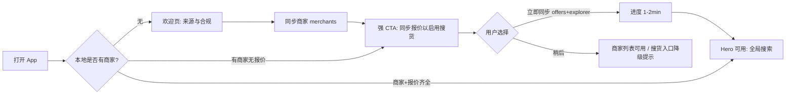
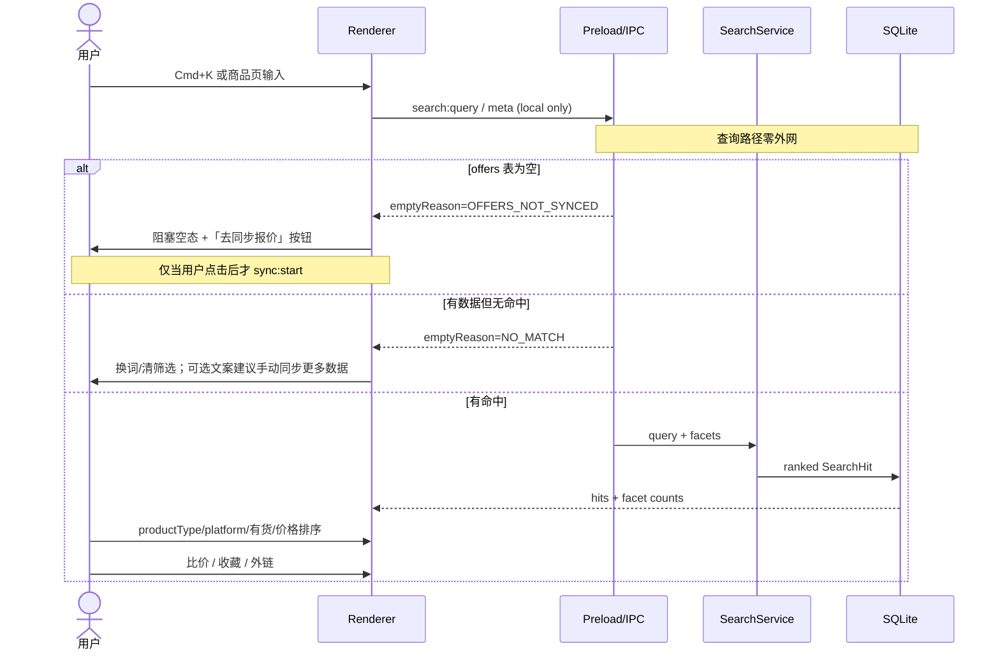
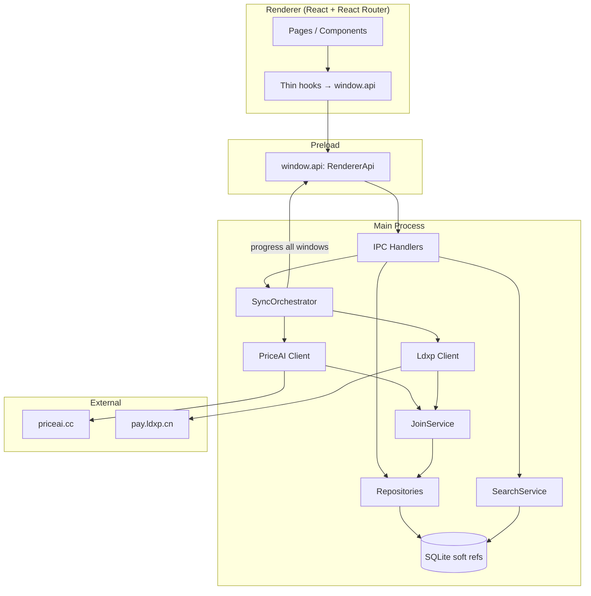
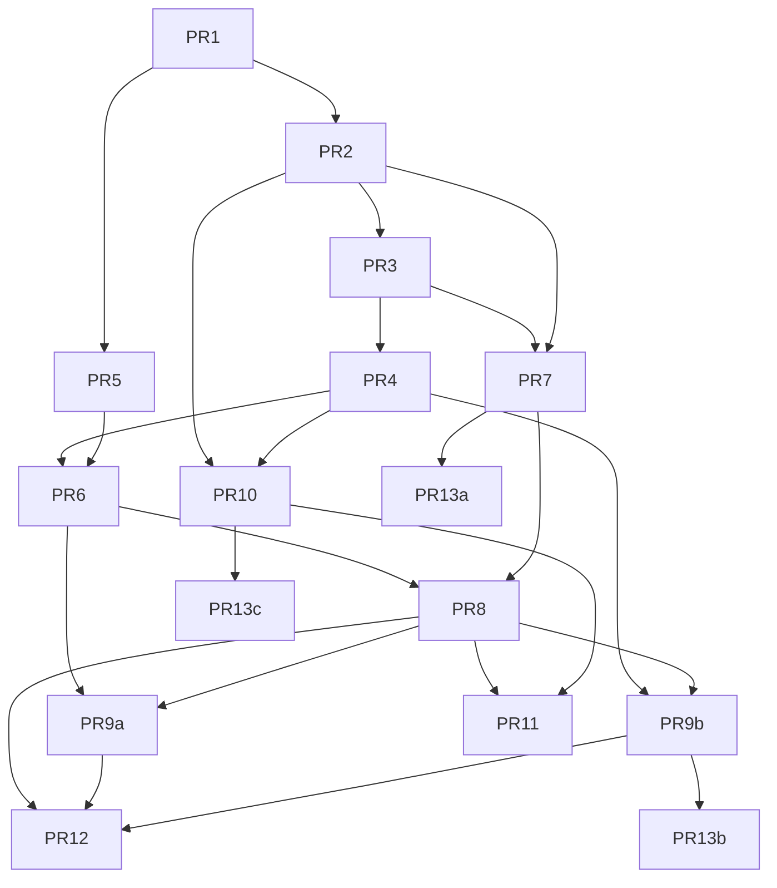

# Merchant Aggregator 桌面端产品与技术设计文档

| 字段 | 内容 |
|---|---|
| **文档标题** | Merchant Aggregator Desktop App — 产品与技术设计 |
| **作者** | Merchant Aggregator contributors |
| **日期** | 2026-07-17 |
| **状态** | Draft（修订 R1 — 回应 design review；**用户产品决策已并入 2026-07-17**） |
| **仓库** | `/Users/zhouhuang/Documents/myCode/merchant-aggregator` |
| **栈** | Electron + React + TypeScript（electron-vite 脚手架，当前为模板空壳） |
| **依据调研** | `docs/priceai-merchant-scrape-plan.md`、`docs/ldxp-merchant-scrape-plan.md` |
| **实现状态** | **暂不写代码** — 用户先审阅设计；PR Plan 仅作实施路线图，待用户确认后再开工 |

### 里程碑工作量粗估（单人·天）

| 里程碑 | 含 PR | 粗估 |
|---|---|---|
| M1 MVP 商家可用 | PR1–PR6 | 4–6 d |
| M2 v1 Hero 搜货比价 | PR7–PR9b | 4–6 d |
| M3 ldxp 深刮 | PR10–PR11 | 2–3 d |
| M4 抛光 / 可选增强 | PR12–PR13c | 2–4 d（P3 按需） |

---

## Overview

Merchant Aggregator 是一款**个人向桌面聚合工具**，面向 AI 账号 / 订阅 / 卡密类发卡网比价场景。用户从 [PriceAI 商家频道](https://priceai.cc/channels?scope=merchants) 拉取商家主档与报价，对链动小铺（`pay.ldxp.cn`，约占 214/333 商家）按需深挖商品列表，在本地完成**跨商家搜索、筛选、比价、收藏与跳转源站**，核心目标是：**更快找到自己想买的那一款商品**。

技术上采用 **Electron main 进程负责采集与 SQLite 持久化，preload 暴露类型安全 IPC，renderer 提供完整产品化 UI**。数据管线分层：PriceAI `/api/merchants` → `/api/explorer` + `/api/offers` →（可选）ldxp `shopApi` 深刮。跨源展示统一为 **`SearchHit` / 展示层 `UnifiedProductView`**（物理表仍分源存储；跨源 SKU 身份为 best-effort）。**搜索只读本地 SQLite，与同步严格解耦**（查询路径零外网请求，降低封禁风险）。遵守限速、缓存与合规边界，不镜像整站、不调用下单/支付接口。

---

## Background & Motivation

### 当前状态

- 仓库为 **electron-vite + React + TS** 模板：`src/main/index.ts` 仅创建窗口与 `ping` IPC；`src/preload` 暴露空 `api`；`src/renderer` 为 demo 页。
- `webPreferences.sandbox: false`（脚手架现状）；`contextIsolation` 依赖 Electron 默认 `true`（实现时显式写死，见 Security）。
- 无本地库、无同步、无业务路由；**调研文档已完备**，实现尚未开始。
- PriceAI 公开接口可分页拿到约 **333** 家商家、**6500+** 条报价；无 `/api/merchants/:id`，报价需本地用 `sourceId` / `sourceStoreName` / URL 辅助 join。
- 商家 host 高度集中于 **链动小铺**（`pay.ldxp.cn`），可二跳拿到更完整的店内商品与库存。

### 痛点（用户侧）

| 痛点 | 说明 |
|---|---|
| 信息分散 | 要找「ChatGPT Plus 某规格」需在多家店/PriceAI 间来回切 |
| 比价成本高 | 同名商品不同店价差大，肉眼对比易漏 |
| 规格难辨 | 质保时长、账密直登/其他交付方式等多埋在标题自由文本里 |
| 库存与健康度不直观 | 商家 `healthStatus`、有货数、风险反馈分散在列表字段里 |
| 深链难用 | 即使看到店名，仍需手动打开店铺再搜商品 |
| 无个人记忆 | 缺收藏、最近浏览；重复检索浪费时间 |

### 为何做桌面端

- 本地 SQLite 可离线检索与过滤（体量小：商家数百、报价数千、深刮按需）。
- 主进程无 CORS 限制，CookieJar / 限速 / 队列更易控。
- 个人工具：数据不出本机，符合「自用研究」定位。

---

## Goals & Non-Goals

### Goals

1. **Hero 用例**：用户输入关键词（如「Claude Pro」「Outlook 邮箱」）→ **仅在本地已同步数据上**跨商家看到匹配商品/报价 → 用 facet/排序区分规格与健康度 → 打开源站购买页。
2. **同步与搜索分离**：用户通过显式同步按钮/同步中心拉取 PriceAI 商家主档与报价；本地列表 + 搜索 + 筛选 + 详情 **永不在查询时打网**。
3. 同步 offers + explorer，构建「标准商品 × 多店报价」比价视图；冷启动引导用户**主动**完成报价同步（不静默自动拉）。
4. 对 ldxp 商家支持**用户显式触发**的按店深刮（进度可见、可取消、限速）；与 PriceAI offer 通过 `goods_key` / item URL 关联（best-effort）。搜索空结果**只建议**用户去同步，**绝不**因搜索自动深刮。
5. 收藏 / 关注商家 / 最近浏览；同步进度与空错态完善。
6. 架构可扩展：后续其它发卡网（`kami` / `dujiao` 等）输出同一 **`SearchHit` 展示契约** 与可选 `UnifiedProductView` 映射（物理表可新增，搜索层归一）。

### Non-Goals（明确不做）

- 不做账号体系、云同步、多用户协作。
- 不调用下单、支付、上传、投诉等写接口（含 ldxp `Pay/*`、`upload/*`）。
- 不做整站镜像或对外公开的数据 API 服务。
- 不做验证码打码、代理黑产、绕过付费墙。
- **搜索路径上不做任何网络请求 / 自动 scrape**（无结果只引导用户手动同步）。
- MVP 不做实时 WebSocket 推价；**价格历史 = P3**。
- **保存搜索 / 再跑查询 = P3**（v1 用收藏具体条目 + 最近浏览代替）。
- 首期不为每个 non-ldxp `collectorKind` 写专用爬虫（仅 PriceAI 聚合字段 + 有 URL 外链）。
- **不保证**跨源 SKU 级 100% 身份统一（best-effort linking only）。

---

## Target User & Jobs-to-be-Done

### 目标用户

| 属性 | 描述 |
|---|---|
| 画像 | 单人使用者（产品本人或同类重度买家） |
| 场景 | 采购 AI 成品账号、订阅/会员、邮箱/接码、虚拟卡等 |
| 环境 | macOS 为主（仓库已有 mac entitlements）；Win/Linux 同构 Electron |
| 技术水平 | 能接受「同步数据源」类工具；不需要懂爬虫 |

### JTBD

1. **当**我想买某类 AI 商品时，**我想**在一个地方搜全网可比商家的报价，**以便**少踩坑、少比价时间。
2. **当**我盯上某家店时，**我想**快速看它有什么货、健康度如何，**以便**决定是否值得进店。
3. **当**我找到目标商品时，**我想**一键跳到源站商品页，**以便**完成购买（本工具不完成交易）。
4. **当**我反复研究时，**我想**收藏商家/商品并看到最近浏览，**以便**续上上次进度。

---

## Core User Journeys

### J1 — 首次启动与冷启动同步（Onboarding）



**冷启动策略（修订）**

1. 用户**主动点击**同步 **merchants**（~4 请求 / ~8s）——快速可见列表；无静默首启全量拉网。
2. 商家同步成功后 **展示二级 CTA**（用户确认后才发起）：「同步商品报价（启用跨店搜索）」；主按钮默认勾选 `explorer + offers`，文案标明约 1–2 分钟。
3. 若用户跳过：全局搜索 / 商品页进入 **阻塞型空态**（非静默无结果），仅提供「去同步中心 / 同步报价」**按钮**（再次由用户点击才 `sync:start`）；商家浏览不受影响。
4. 默认 **不自动后台同步**（K15）；仅当数据超过 TTL 时顶栏 **提示**刷新（不静默打网）。搜索本身永不触发同步。

### J2 — 发现商家 → 浏览详情

1. 侧栏进入 **商家**。
2. 关键词 / 平台 / 健康状态 / host 类型过滤（**本地**过滤已同步数据）。
3. 点击行 → 详情：概况字段、代表价、平台 tags、`shopUrl` 外链、「同步该店商品」（ldxp 才启用，**显式按钮**）。
4. 详情内 Tab：PriceAI 关联报价 | 源站商品（若已深刮）| 原始元数据（可折叠）。

### J3 — Hero：跨商家找商品（Find Product）

> **硬约束（K23）**：`Cmd+K` / `search:query` / 商品列表过滤 **只读 SQLite**。SearchService **禁止** import/调用任何 HTTP client、SyncOrchestrator 或 ldxp scraper。无结果时 UI 仅展示「建议去同步」类 CTA，**不**自动 `sync:start`、**不**自动深刮。



**规格差异展示（Variant discrimination）**

- 结果行 **必显**：`title`（原始报价/商品标题）+ `catalogDisplayName`（若有 explorer 映射）+ 店名 + 价 + 库存/状态 + 健康徽章 + `kind` 来源标签。
- 标题中常见信号（质保、月数、账密直登、成品号等）不做 NLP 实体抽取（P3 可做）；v1 用：
  - **Facet**：`platform`、`productType`（来自 offer/catalog；ldxp 用 categoryName 映射到宽松 tag）
  - **关键词 chips**（快捷）：`质保`、`直登`、`成品`、`Pro`、`Plus`、`邮箱` —— 追加到 `q` 或 `titleContains[]`
  - 结果 snippet：对 query token 做 **大小写不敏感高亮**（renderer）

### J4 — 深刮单店（ldxp）

1. 商家详情识别 `host === pay.ldxp.cn`（或可解析 token）。
2. 用户点击「同步店铺商品」→ 主进程：warmup → info → categoryList → goodsList（**仅此显式路径**可打 ldxp 网）。
3. UI：进度、可取消；`NEED_BROWSER` 明确错误码与文案。
4. 深刮完成后：`shop_products` 参与**后续**本地全局搜索；并尝试与已有 offers 按 `goods_key` 链接。

### J5 — 收藏 / 最近浏览

- 商品/报价/商家均可收藏。
- **保存搜索（query 本身）明确 P3**；v1 不实现 re-run saved query。
- 浏览详情写入 `recent_views`（LRU 100，见 Data lifecycle）。

### J6 — 打开源站

- 外链经 main `shell.openExternal`，校验见 Security。
- **allowlist 内 host**：可直接打开；**allowlist 外 host**：默认弹出**确认对话框**后再打开（K24）；设置可收紧为直接拒绝。
- 提供「复制链接」。

---

## Information Architecture & Navigation

```text
┌──────────────────────────────────────────────────────────┐
|  Merchant Aggregator          [🔍 全局搜索…]  [同步 ▾]   |
├────────────┬─────────────────────────────────────────────┤
| 首页/发现   |  主内容区（路由出口）                          |
| 商家        |                                             |
| 商品/报价   |                                             |
| 比价        |                                             |
| 收藏        |                                             |
| 最近浏览    |                                             |
| 同步中心    |                                             |
| 设置        |                                             |
└────────────┴─────────────────────────────────────────────┘
```

| 导航项 | 路由 | 职责 |
|---|---|---|
| 首页/发现 | `/` | 快捷入口、同步状态、冷启动 CTA、最近浏览摘要 |
| 商家 | `/merchants`、`/merchants/:id` | 列表 + 详情 |
| 商品/报价 | `/offers` | 跨店报价；依赖 offers |
| 比价 | `/compare?productId=` | 标准商品多店价；无 productId 时引导从搜索进入 |
| 收藏 | `/favorites` | 商家 + offer + shop_product |
| 最近浏览 | `/recent` | 时间线 |
| 同步中心 | `/sync` | 任务历史、进度、错误码 |
| 设置 | `/settings` | 限速、TTL、暂停同步、UA 策略说明、数据目录、清空 |

**全局搜索**：顶栏 + `Cmd/Ctrl+K`。**纯本地检索**；数据不足时引导用户到同步中心，不在搜索时联网。

---

## Feature List by Phase

### MVP（P0）

| 功能 | 说明 |
|---|---|
| PriceAI 商家全量同步 | `/api/merchants` 分页 upsert |
| 商家列表/详情/筛选 | 含 health、platforms、外链 |
| 手动同步 + 进度 + 可取消 | |
| **最小设置：暂停同步、请求间隔、TTL** | 与首次联网同步同时可用（合规） |
| 空/加载/错误态 + 稳定 error code | |
| SQLite + raw 保留 | |

### v1（P1）— Hero

| 功能 | 说明 |
|---|---|
| explorer + offers 同步与 soft join | 含 product stub upsert |
| 全局 `SearchHit` 本地搜索 + ranking（零网络） | |
| Facet：platform、productType、仅有货、价格区间 | |
| 比价视图（有 productId）/ 无标准商品 fallback | |
| 冷启动强制 CTA 同步报价 | |
| 收藏 + 最近浏览 | |
| 同步中心 | |

### v1.5（P2）— ldxp

| 功能 | 说明 |
|---|---|
| ldxp HTTP 契约客户端 + 单店深刮 | |
| goods_key ↔ offer.url 链接 | |
| 源站商品进搜索 | |
| description：列表纯文本截断（main）；富文本可选 DOMPurify | |

### Nice-to-have（P3）

| 功能 | 说明 |
|---|---|
| 价格历史 | sync diff → `price_history` |
| 定时同步 + Notification | 默认关 |
| **保存搜索 / 再执行 query** | |
| 导出 CSV/JSON | 可提前到 M2 抛光 PR |
| Playwright ESA 兜底 | L3 |
| FTS5 | 若 LIKE 体感不足 |
| 非 ldxp 适配器 | kami / dujiao |
| 标题 signal 解析（质保月数等） | |

---

## UX 规格（关键界面）

### 同步 UX

| 状态 | 表现 |
|---|---|
| Idle | 上次同步相对时间 + 按钮 |
| Running | 分 phase 进度：`merchants 200/333`、`offers 1200/6500` |
| Partial | 横幅 + 同步中心错误码 |
| Degraded | `DEGRADED` 文案与重试 |
| Cancelled | 保留已提交 upsert；`CANCELLED` |

### 搜索空态矩阵

> 搜索 IPC **永不返回网络错误**（查询不触网）。`NETWORK` / `SCHEMA_VALIDATION` 仅出现在**同步任务**路径。

| 条件 | UI |
|---|---|
| `offers` 行数 = 0 | **阻塞空态**：说明「跨店搜货依赖本地已同步的报价」+ 按钮「去同步报价 / 打开同步中心」；**点击后**才 `sync:start(offers_bundle)`；Cmd+K 同样。**禁止**打开搜索时自动同步 |
| 有 offers，query 无命中 | 建议换词 / 清筛选；次要文案可写「若怀疑数据过期，可到同步中心手动刷新报价；需要店内更全货源时，可在商家详情**手动**同步该 ldxp 店」——**仅为文案引导，不自动发起任何 scrape** |
| 本地无商家 | 引导「去同步商家」按钮（用户点击后才联网） |
| 同步任务失败（非搜索） | 同步中心展示 `NETWORK` / `SCHEMA_VALIDATION` 等 |

### 商家列表 / 详情

- 列：名称 | host | 健康 | 有货/报价 | 平台 | 代表商品 | 代表价 | 更新时间。
- 详情 Tabs：概览 | PriceAI 报价 | 源站商品 | raw JSON。

### 结果行（Search / Offers）

必须可见差异信息：

```text
[in_stock] ¥12.00  店名(healthy)
ChatGPT 普号                    ← catalogDisplayName（若有）
GPT Free-账密直登-长效outlook… ← title（高亮 query）
来源: PriceAI报价 · 打开源站
```

### Hero 端到端（修订）

1. 用户主动同步商家 → 确认 CTA 同步报价 → 进度完成（全部用户发起）。
2. `Cmd+K` **本地**搜「Claude Pro」；facet 选 `订阅/会员` + 仅有货（无 API 调用）。
3. 排序价格↑；观察标题差异（质保/时长）；健康 failing 默认降权不隐藏。
4. 有 `productId` 则开比价抽屉；否则「无标准商品 — 显示原始命中列表」。
5. 收藏 + 外链购买（非 allowlist host 先确认对话框）。

---

## Proposed Design（技术架构）

### 总览



### Electron 分层

| 进程 | 职责 | 禁止 |
|---|---|---|
| **main** | HTTP、CookieJar、SQLite、队列、限速、IPC、`openExternal`、**HTML→纯文本剥离（列表用）** | 复杂 UI |
| **preload** | 窄 API | 直接 DB |
| **renderer** | 路由、虚拟列表、表单；**富文本仅可选路径 + DOMPurify** | 裸 `fetch` 目标站、任意 SQL |

### 模块布局（`src/`）

```text
src/
  main/
    index.ts
    ipc/{channels.ts, register.ts}
    db/{connection.ts, migrate.ts, repositories/*}
    services/
      sync-orchestrator.ts
      search-service.ts
      join-service.ts
      rate-limiter.ts
      http-client.ts
      html-text.ts              # strip tags for list storage/display
    platforms/
      priceai/{client,fetcher-*,normalize,types,zod.ts}
      ldxp/{client,parser,scraper,normalize,types,zod.ts}
    utils/{logger.ts, time.ts, url-safety.ts}
  preload/{index.ts, index.d.ts, api.ts}
  renderer/src/
    {main,App}.tsx
    routes/ pages/ components/ hooks/ lib/ styles/
  shared/
    types/{merchant,offer,product,search,sync,settings,ipc,errors}.ts
    constants.ts
    normalize-map.md            # 或 constants 内映射表（见下）
```

**UI 状态（K16）**：MVP 使用 **React Router + 薄 hooks 调 `window.api`**，**不引入 Zustand/React Query**（列表简单、数据在 SQLite；同步状态靠 IPC 事件即可）。P3 若缓存复杂再评估。

**UI 视觉（K16）**：**不引入大型组件库**；CSS modules（或单文件 token + 组件 class）自研基础控件（Button/Table/Badge/Empty）。降低 PR5 体积与主题耦合。

Alias：`@shared` → `src/shared`（main/preload/renderer 共用）。

---

## Multi-source product model

> **原则**：物理存储分表（源真不丢字段）；**搜索与 UI 只消费统一 DTO**。跨源 SKU 身份为 **best-effort**，不保证全局唯一商品图。

### 展示契约

```ts
// src/shared/types/search.ts

/** 搜索/列表统一命中 */
export type SearchHitKind = 'offer' | 'shop_product' | 'catalog_product' | 'merchant'

export interface SearchHit {
  kind: SearchHitKind
  /** 稳定行 id：offer:{id} | shop:{id} | catalog:{id} | merchant:{id} */
  id: string
  title: string
  subtitle?: string                 // 店名或标准商品名
  catalogProductId?: string | null
  catalogDisplayName?: string | null
  merchantId?: string | null
  merchantName?: string | null
  merchantHealth?: string | null
  price?: number | null
  currency?: string | null          // 缺省展示按 CNY；跨币种不自动换汇，排序时 null 沉底
  status?: string | null            // in_stock / ...
  stockCount?: number | null
  platform?: string | null
  productType?: string | null
  sourceUrl?: string | null
  /** ldxp goods_key 或从 offer.url 解析 */
  ldxpGoodsKey?: string | null
  ldxpToken?: string | null
  freshnessStatus?: string | null
  score: number                     // ranking 分，UI 可忽略
  fetchedAt?: string | null
}

/**
 * 可选归一视图（详情/导出）—— 不强制落单表
 * 未来 kami/dujiao normalize() 也应产出此形状或 SearchHit
 */
export interface UnifiedProductView {
  source: 'priceai_offer' | 'ldxp' | 'catalog' | string
  sourceRef: string                 // offer.id / shop_products.id / catalog id
  merchantId?: string | null
  title: string
  price: number | null
  currency: string | null
  url: string | null
  platform?: string | null
  productType?: string | null
  catalogProductId?: string | null
  ldxpGoodsKey?: string | null
  stock?: number | null
  rawKind: SearchHitKind
}
```

### 跨源链接规则（JoinService + SearchService）

优先级从高到低：

| 优先级 | 规则 | 用途 |
|---|---|---|
| L1 | `offer.source_id` **精确等于** `merchant.source_id`（非空） | offer → merchant |
| L2 | URL 解析：`offer.url` 匹配 `https?://pay\.ldxp\.cn/item/([A-Za-z0-9]+)` → `ldxp_goods_key`；`merchant.ldxp_token` 或 shop path `/shop/{token}` | offer → merchant / shop_product |
| L3 | 店名归一化后 **唯一** 命中 `merchant.name|store_name` | offer → merchant（歧义则 **不连**） |
| L4 | `offer.product_id` / nested product → `catalog_products`（stub 或 explorer） | offer → catalog |
| L5 | `shop_products.source_goods_key` == offer 解析出的 `ldxp_goods_key`（且 token 一致更佳） | shop_product ↔ offer |
| L6 | 标题/alias 软匹配（normalize 后 exact 或包含） | **仅 UI 提示「可能相关」**，不写死 FK |

**明确声明**：全源 SKU 级 identity **不保证**；比价以 `catalogProductId` 为准；无标准商品时 fallback 见下。

### Compare 行为

```ts
// products:compare
// 1) 若 productId 有 catalog 行：返回该 product + 所有 product_id 匹配的 offers
//    + 可选：同 merchant 下已链接的 shop_products（L5）作补充行，标记 kind=shop_product
// 2) 若 productId 未知但调用方传 clusterKey=title_norm：
//    返回 title_norm 相同的 offers ∪ shop_products（弱比价，banner 说明「非标准商品聚合」）
// 3) ldxp-only 命中无 catalog：UI 不进标准比价页，留在搜索结果「原始命中」；
//    提供「以标题聚合弱比价」次级操作
```

v1 Hero **不阻塞**于 explorer：offers 可先同步；nested product stub 保证 `product_id` 可展示；explorer 后续 enrich 最低价摘要。无任何 `catalogProductId` 时比价页展示引导文案，搜索仍可用。

### 物理表 vs 统一模型

- **不**建单一 `unified_products` 宽表（避免同步冲突与源字段丢失）。
- `search:query` 在 SQL 层 UNION 后映射为 `SearchHit[]`。
- 新平台：新增表或 `shop_products.source` 扩展 + normalize → `SearchHit`。

---

## Data Pipeline

### 阶段 1 — PriceAI Merchants

```text
limit=100, interval 300–800ms, concurrency=1
GET /api/merchants?limit&offset
degraded → backoff retry
upsert by id；解析 shop_url → ldxp_token（若 host 为 pay.ldxp.cn）
停止条件同调研文档
```

### 阶段 2 — Explorer + Offers（顺序绑定到 `full` job）

```text
1) GET /api/explorer
   normalize 响应（见字段映射：若为数组 rows 或 {products} 包裹，适配为列表）
   upsert catalog_products
2) GET /api/offers?limit=100&offset=…
   对每条 offer：
     a. upsert nested product stub → catalog_products（仅填 id/slug/displayName/platform/productType；不覆盖 explorer 已有 richer 字段）
     b. upsert offer（merchant_id 经 JoinService 解析，可 null）
     c. 解析 offer.url → ldxp_goods_key 列（派生）
join 统计写入 job meta / 日志（PR7 即打日志，不必等诊断 UI）
```

**禁止**：依赖服务端 `merchantId`/`sourceId`/`stock=in_stock` 过滤（调研证实无效/有害）。

### 阶段 3 — ldxp 深刮（用户触发）

见下方 **ldxp HTTP contract**。

### 增量与 TTL

| 数据 | 默认 TTL | 策略 |
|---|---|---|
| merchants | **30 min**（统一默认；设置可改 15–120） | 未过期且 `force=false` 则跳过；可选对比 `generatedAt` 短路写库 |
| explorer / offers | **60 min** | 同上 |
| ldxp 单店 | **15 min** 防重复点 | 用户可 force |

默认 **全量拉取**（体量小）；`generatedAt` / 行 hash 无变化可跳过 upsert 写放大。

---

## ldxp HTTP contract（完整）

基址：`https://pay.ldxp.cn`。Method：`POST` JSON；成功：**HTTP 200 且 `body.code === 1`**。

### Headers（每个 API 请求）

| Header | 值 |
|---|---|
| `Content-Type` | `application/json` |
| `Accept` | `application/json, text/plain, */*` |
| `Origin` | `https://pay.ldxp.cn` |
| `Referer` | `https://pay.ldxp.cn/shop/{token}` |
| `User-Agent` | **浏览器型** Chrome UA（见双 UA 策略） |
| `Visitorid` | 客户端生成的稳定随机串（app 生命周期持久化到 settings） |

### 双 UA 策略（K19）

| 目标 | UA |
|---|---|
| PriceAI | `MerchantAggregator/{version} (+personal; local research)` — 可识别、非搜索引擎伪装 |
| ldxp | 固定 Chrome 桌面 UA 字符串（常量 `LDXP_BROWSER_UA`）— 降低 ESA 异常指纹 |

设置页只允许改 PriceAI UA；ldxp UA 不暴露为自由文本（避免用户填坏）。

### 流程与硬限制

```text
parseToken(url|token)  // 见调研 regex
CookieJar 会话
GET /shop/{token}      // warmup：种 acw_tc / cdn_sec_tc / PHPSESSID
POST /shopApi/Shop/info { token, category_key: null }
for goods_type in goods_type_sort (skip *_count==0):
  POST categoryList
  current=1, pageSize=20   // HARD CAP：禁止 pageSize>50；禁止 999999
  loop goodsList until done; sleep 400–1000ms
可选 goodsInfo：默认 OFF
  注意：列表 extend.stock_count 可能缺失 → stock 字段 null，UI 显示「库存未知」而非 0
```

### 限速

| 范围 | 值 |
|---|---|
| 单店 | **≤ 1–2 QPS**（串行 + minInterval ≥ 500ms 默认） |
| 全局 ldxp+其它 | ≤ 3–5 QPS 预算 |
| 多店队列 | concurrency **1** |

### 挑战检测 → `NEED_BROWSER`

在 client 层：

1. `Content-Type` 非 JSON，或 body 无法 `JSON.parse`
2. HTML 含 ESA/挑战特征（如 `acw_sc__v2`、明显 challenge 脚本壳）
3. 连续 403/非 1 业务码且 body 非预期结构  

→ 抛 `AppError(code: 'NEED_BROWSER')`，**不**死循环重试；job 标记 failed/partial。P3 再 Playwright。

### 禁止调用

- `POST /shopApi/Pay/order`、`Pay/query`
- `POST /shopApi/upload/file`
- 任何下单/支付/上传链路

### normalize → shop_products / SearchHit

沿用调研 `UnifiedProduct` 字段映射；`id = ldxp:{token}:{goods_key}`。

---

## Data Model（SQLite）

路径：`app.getPath('userData')/merchant-aggregator.db`。  
库：**better-sqlite3**。

### PRAGMA 与 FK 策略（K17）

```sql
PRAGMA foreign_keys = ON;   -- 开启，但关键交叉源引用使用「软关联」不建 FK
```

| 引用 | 策略 |
|---|---|
| `offers.merchant_id` | **软引用**，**无 FK**；可 null |
| `offers.product_id` | **软引用**，**无 FK**；插入前 **stub upsert** nested product |
| `shop_products.merchant_id` | **软引用**，无 FK |
| `favorites.target_id` | 软引用（目标可删后收藏仍在，展示「已失效」） |

硬 FK 仅用于无跨源时序问题的表（如 `schema_migrations` 无依赖）。

### Schema（修订）

```sql
CREATE TABLE schema_migrations (
  version INTEGER PRIMARY KEY,
  applied_at TEXT NOT NULL
);

CREATE TABLE merchants (
  id TEXT PRIMARY KEY,
  name TEXT NOT NULL,
  store_name TEXT,
  host TEXT,
  shop_url TEXT,
  entry_url TEXT,
  source_id TEXT,
  source_name TEXT,
  collector_kind TEXT,
  health_status TEXT,
  offer_count INTEGER NOT NULL DEFAULT 0,
  in_stock_count INTEGER NOT NULL DEFAULT 0,
  out_of_stock_count INTEGER NOT NULL DEFAULT 0,
  product_count INTEGER NOT NULL DEFAULT 0,
  platform_count INTEGER NOT NULL DEFAULT 0,
  platforms_json TEXT NOT NULL DEFAULT '[]',  -- 333 行级 JSON 过滤可接受；见索引说明
  product_types_json TEXT NOT NULL DEFAULT '[]',
  representative_product TEXT,
  representative_offer_title TEXT,
  representative_price REAL,                 -- 展示用浮点；不用于账务
  representative_currency TEXT,
  lowest_hit_count INTEGER DEFAULT 0,
  warranty_lowest_hit_count INTEGER DEFAULT 0,
  risk_feedback_count INTEGER DEFAULT 0,
  has_platform_aftersales INTEGER NOT NULL DEFAULT 0,
  shop_created_at TEXT,
  included_at TEXT,
  last_success_at TEXT,
  latest_seen_at TEXT,
  consecutive_failures INTEGER DEFAULT 0,
  observation_started_at TEXT,
  generated_at TEXT,
  fetched_at TEXT NOT NULL,
  raw_json TEXT,
  ldxp_token TEXT,
  name_norm TEXT                             -- 归一化店名，供 join
);

CREATE INDEX idx_merchants_source_id ON merchants(source_id);
CREATE INDEX idx_merchants_host ON merchants(host);
CREATE INDEX idx_merchants_name_norm ON merchants(name_norm);
CREATE INDEX idx_merchants_health ON merchants(health_status);
CREATE INDEX idx_merchants_ldxp_token ON merchants(ldxp_token);

CREATE TABLE catalog_products (
  id TEXT PRIMARY KEY,
  slug TEXT,
  display_name TEXT NOT NULL,
  platform TEXT,
  product_type TEXT,
  aliases_json TEXT,
  lowest_price REAL,
  lowest_price_meta_json TEXT,
  source_of_truth TEXT NOT NULL DEFAULT 'stub', -- 'stub' | 'explorer'
  fetched_at TEXT NOT NULL,
  raw_json TEXT
);

CREATE TABLE offers (
  id TEXT PRIMARY KEY,
  merchant_id TEXT,                -- soft, nullable, NO FK
  source_id TEXT,
  source_store_name TEXT,
  product_id TEXT,                 -- soft, nullable, NO FK
  product_slug TEXT,
  title TEXT,
  price REAL,                      -- 展示用；多币种不自动 FX
  currency TEXT,
  status TEXT,
  effective_status TEXT,
  freshness_status TEXT,
  url TEXT,
  stock_count INTEGER,
  platform TEXT,
  product_type TEXT,
  ldxp_goods_key TEXT,             -- 自 url 解析
  captured_at TEXT,
  fetched_at TEXT NOT NULL,
  raw_json TEXT
);

CREATE INDEX idx_offers_merchant ON offers(merchant_id);
CREATE INDEX idx_offers_source_id ON offers(source_id);
CREATE INDEX idx_offers_product ON offers(product_id);
CREATE INDEX idx_offers_platform ON offers(platform);
CREATE INDEX idx_offers_price ON offers(price);
CREATE INDEX idx_offers_status ON offers(status);
CREATE INDEX idx_offers_title ON offers(title);           -- LIKE 搜索
CREATE INDEX idx_offers_ldxp_goods_key ON offers(ldxp_goods_key);

CREATE TABLE shop_products (
  id TEXT PRIMARY KEY,
  source TEXT NOT NULL,
  merchant_id TEXT,                -- soft
  source_shop_token TEXT NOT NULL,
  source_goods_key TEXT NOT NULL,
  source_url TEXT,
  shop_name TEXT,
  title TEXT NOT NULL,
  price REAL,
  market_price REAL,
  currency TEXT DEFAULT 'CNY',
  goods_type TEXT,
  category_id INTEGER,
  category_name TEXT,
  stock INTEGER,                   -- null = 未知，非 0
  image TEXT,
  description_text TEXT,           -- main 剥离后的纯文本（列表/搜索）
  description_html TEXT,           -- 可选保留；默认截断或不存长 HTML
  fetched_at TEXT NOT NULL,
  raw_json TEXT,
  UNIQUE (source, source_shop_token, source_goods_key)
);

CREATE INDEX idx_shop_products_merchant ON shop_products(merchant_id);
CREATE INDEX idx_shop_products_title ON shop_products(title);
CREATE INDEX idx_shop_products_price ON shop_products(price);
CREATE INDEX idx_shop_products_goods_key ON shop_products(source_goods_key);

CREATE TABLE favorites (
  id INTEGER PRIMARY KEY AUTOINCREMENT,
  target_type TEXT NOT NULL,
  target_id TEXT NOT NULL,
  note TEXT,
  created_at TEXT NOT NULL,
  UNIQUE (target_type, target_id)
);

-- touch 语义：同一 target 只保留一行，viewed_at 更新
CREATE TABLE recent_views (
  id INTEGER PRIMARY KEY AUTOINCREMENT,
  target_type TEXT NOT NULL,
  target_id TEXT NOT NULL,
  title_snapshot TEXT,
  viewed_at TEXT NOT NULL,
  UNIQUE (target_type, target_id)
);

CREATE INDEX idx_recent_viewed_at ON recent_views(viewed_at DESC);

CREATE TABLE sync_jobs (
  id TEXT PRIMARY KEY,
  job_type TEXT NOT NULL,
  status TEXT NOT NULL,
  phase TEXT,
  current INTEGER DEFAULT 0,
  total INTEGER DEFAULT 0,
  message TEXT,
  error_code TEXT,
  error_json TEXT,
  started_at TEXT,
  finished_at TEXT,
  meta_json TEXT                   -- 含 joinHitRate 等
);

CREATE TABLE app_settings (
  key TEXT PRIMARY KEY,
  value_json TEXT NOT NULL
);
```

### 店名归一化与 join 算法（碰撞安全）

```ts
function nameNorm(s: string): string {
  return s.normalize('NFKC').trim().replace(/\s+/g, ' ').toLocaleLowerCase('zh-CN')
}

function buildMerchantIndexes(rows: MerchantRow[]): MerchantIndexes {
  const bySourceId = new Map<string, string>()
  const byName = new Map<string, string[]>() // norm → merchant ids
  const byLdxpToken = new Map<string, string>()
  for (const m of rows) {
    if (m.source_id) bySourceId.set(m.source_id, m.id)
    if (m.ldxp_token) byLdxpToken.set(m.ldxp_token, m.id)
    const keys = new Set(
      [m.name, m.store_name].filter(Boolean).map((x) => nameNorm(x!))
    )
    for (const k of keys) {
      const arr = byName.get(k) ?? []
      arr.push(m.id)
      byName.set(k, arr)
    }
  }
  return { bySourceId, byName, byLdxpToken }
}

function resolveMerchantId(offer: OfferJoinInput, idx: MerchantIndexes): {
  merchantId: string | null
  method: 'source_id' | 'url_token' | 'name_unique' | 'none'
  ambiguous?: boolean
} {
  if (offer.sourceId && idx.bySourceId.has(offer.sourceId)) {
    return { merchantId: idx.bySourceId.get(offer.sourceId)!, method: 'source_id' }
  }
  // URL assist: shop token or item page → token map via merchants only for shop URL;
  // item URL: goods_key stored on offer; merchant via referrer token if parseable from related fields
  const shopToken = parseLdxpShopToken(offer.merchantShopUrlHint ?? '') 
    ?? parseTokenFromOfferContext(offer)
  if (shopToken && idx.byLdxpToken.has(shopToken)) {
    return { merchantId: idx.byLdxpToken.get(shopToken)!, method: 'url_token' }
  }
  const itemKey = parseLdxpItemKey(offer.url) // /item/([A-Za-z0-9]+)
  // item key alone does not identify merchant; used for shop_product link (L5)

  const n = offer.sourceStoreName ? nameNorm(offer.sourceStoreName) : ''
  if (n && idx.byName.has(n)) {
    const ids = [...new Set(idx.byName.get(n)!)]
    if (ids.length === 1) return { merchantId: ids[0], method: 'name_unique' }
    // 碰撞：不连，记诊断
    return { merchantId: null, method: 'none', ambiguous: true }
  }
  return { merchantId: null, method: 'none' }
}
```

诊断计数：`join.source_id` / `join.url_token` / `join.name_unique` / `join.ambiguous_name` / `join.unmatched` 写入 job `meta_json` 与日志（PR7 起）。

### URL 解析

```ts
parseLdxpShopToken(input): /shop/([A-Za-z0-9]+) 或纯 token /^[A-Za-z0-9]{6,16}$/
parseLdxpItemKey(url): pathname /item/([A-Za-z0-9]+)
```

### Product stub 策略

```ts
// 每条 offer 写入前：
upsertCatalogStub({
  id: nested.product.id,
  slug: nested.product.slug,
  display_name: nested.product.displayName,
  platform: nested.product.platform,
  product_type: nested.product.productType,
  source_of_truth: 'stub',  // 仅当现有行不存在或仍为 stub 时写入；explorer 行 (source_of_truth=explorer) 不降级覆盖
})
```

### 数据生命周期

| 主题 | 策略 |
|---|---|
| 上游消失的 merchant/offer | **默认 upsert-only，不自动删除**（避免误伤收藏）；设置提供「清理：删除本地有而本轮同步未见到的 offers」可选工具（默认关） |
| `recent_views` | `INSERT … ON CONFLICT(target_type,target_id) DO UPDATE SET viewed_at=excluded.viewed_at`；若 COUNT>100，删除 `viewed_at` 最旧的多余行 |
| 损坏 DB | 启动迁移失败 → 对话框：打开日志 / 备份损坏文件为 `.corrupt` / 重建空库 |
| 货币 | 多币种并存时 **不换汇**；排序 `ORDER BY currency IS NULL, price`；UI 标注币种 |
| `platforms_json` | 333 行可在 SQL 外过滤或 `LIKE '%"ChatGPT"%'`；可接受 |

### Explorer 响应归一

调研未钉死外层包裹。实现时：

```ts
function coerceExplorerList(body: unknown): ExplorerProduct[] {
  if (Array.isArray(body)) return body
  if (body && typeof body === 'object') {
    const o = body as Record<string, unknown>
    for (const k of ['products', 'rows', 'items', 'data']) {
      if (Array.isArray(o[k])) return o[k] as ExplorerProduct[]
    }
  }
  throw new AppError('SCHEMA_VALIDATION', 'Unexpected explorer shape')
}
```

用第一次成功响应当 fixture 快照。

### 存储量粗估

同前：merchants <2MB；offers ~10–20MB；ldxp 按需；`description_html` 默认截断至 2–8KB 或只存 `description_text`。

---

## Search ranking & facets

### 本地-only 契约（K23）

| 规则 | 说明 |
|---|---|
| 数据源 | 仅 SQLite：`offers` / `catalog_products` / `shop_products` / `merchants` |
| 网络 | `search:query` / `search:meta` / 列表 filter **零** HTTP；实现层与 `platforms/*` 无调用边 |
| 同步 | 独立动作：`sync:start`、同步中心、详情「同步该店」；**搜索空态 CTA 只导航或等待用户再点一次确认** |
| 目标 | 最小化 API 调用、降低 IP 封禁风险；用户掌控何时打网 |

### Facets（v1）

- `platform`（多选）
- `productType`（多选）
- `inStockOnly`：`status in ('in_stock') OR effective_status='available'`（字段以实际为准；null 不满足 only）
- `priceMin` / `priceMax`
- `health`：基于 joined merchant（无 merchant 时不参与 health 过滤除非「含未关联」）
- `titleContains[]`：额外 AND 子串（chips）

### 评分公式（实现必须一致）

```text
score = 0
+ 40  if title_norm contains full query
+ 25  if catalog_display_name contains query
+ 15  if merchant_name contains query
+ 10  per query token hit in title (cap 30)
+ 15  if in_stock / available
+ 10  if merchant.health_status == 'healthy'
- 20  if merchant.health_status == 'failing'
- 10  if merchant.health_status == 'retrying'
- 5   if freshness_status == 'stale' (若有)
+ 5   if kind == 'offer' and catalogProductId present

最终列表默认 ORDER BY score DESC, price ASC NULLS LAST
用户选择「价格↑」时：score 仅作次级键或忽略（UI 明确当前排序）
```

LIKE 延迟预算：≤ 6.5k offers + 数 k shop_products，目标 **p95 < 100ms** 本地查询；超过再上 FTS5（P3）。

---

## Field mapping（API → DB → UI）

### PriceAI Merchant

| API 字段 | DB 列 | UI 标签 |
|---|---|---|
| `id` | `id` | — |
| `name` | `name` | 店名 |
| `storeName` | `store_name` | 店名（备） |
| `host` | `host` | 主机 |
| `shopUrl` | `shop_url` | 店铺链接 |
| `entryUrl` | `entry_url` | 入口 |
| `sourceId` | `source_id` | 源 ID |
| `sourceName` | `source_name` | 源名称 |
| `collectorKind` | `collector_kind` | 采集类型 |
| `healthStatus` | `health_status` | 健康 |
| `offerCount` | `offer_count` | 报价数 |
| `inStockCount` | `in_stock_count` | 有货 |
| `outOfStockCount` | `out_of_stock_count` | 缺货 |
| `productCount` | `product_count` | 商品数 |
| `platformCount` | `platform_count` | 平台数 |
| `platforms` | `platforms_json` | 平台 |
| `productTypes` | `product_types_json` | 类型 |
| `representativeProduct` | `representative_product` | 代表商品 |
| `representativeOfferTitle` | `representative_offer_title` | 代表标题 |
| `representativePrice` | `representative_price` | 代表价 |
| `representativeCurrency` | `representative_currency` | 币种 |
| `lowestHitCount` | `lowest_hit_count` | 最低价命中 |
| `warrantyLowestHitCount` | `warranty_lowest_hit_count` | 质保最低命中 |
| `riskFeedbackCount` | `risk_feedback_count` | 风险反馈 |
| `hasPlatformAftersalesMechanism` | `has_platform_aftersales` | 平台售后 |
| `shopCreatedAt` | `shop_created_at` | 开店时间 |
| `includedAt` | `included_at` | 纳入时间 |
| `lastSuccessAt` | `last_success_at` | 最近成功 |
| `latestSeenAt` | `latest_seen_at` | 最近见到 |
| `consecutiveFailures` | `consecutive_failures` | 连续失败 |
| `observationStartedAt` | `observation_started_at` | 观测开始 |
| （响应）`generatedAt` | `generated_at` | 上游生成 |
| — | `fetched_at` / `raw_json` / `ldxp_token` / `name_norm` | 本地元数据 |

### PriceAI Offer（响应行 `offer` + `product`）

| API 字段 | DB 列 | UI 标签 |
|---|---|---|
| `offer.id` | `id` | — |
| `offer.sourceId` | `source_id` | |
| `offer.sourceStoreName` | `source_store_name` | 店名 |
| `offer.sourceTitle` | `title` | 标题 |
| `offer.price` | `price` | 价格 |
| `offer.currency` | `currency` | 币种 |
| `offer.status` | `status` | 库存状态 |
| `offer.effectiveStatus` | `effective_status` | 有效状态 |
| `offer.freshnessStatus` | `freshness_status` | 新鲜度 |
| `offer.url` | `url` / 解析 `ldxp_goods_key` | 源站链接 |
| `offer.stockCount` | `stock_count` | 库存 |
| `offer.capturedAt` | `captured_at` | 采集时间 |
| `product.id` | `product_id` + stub | 标准商品 |
| `product.slug` | `product_slug` | |
| `product.displayName` | （catalog）`display_name` | 标准名 |
| `product.platform` | `platform` | 平台 |
| `product.productType` | `product_type` | 类型 |
| join | `merchant_id` | 关联商家 |

### ldxp goodsList item

| API 字段 | DB 列 | UI |
|---|---|---|
| `goods_key` | `source_goods_key` | |
| `name` | `title` | 标题 |
| `price` | `price` | 价 |
| `market_price` | `market_price` | 划线价 |
| `link` | `source_url` | 链接 |
| `goods_type` | `goods_type` | 大类 |
| `category.id/name` | `category_*` | 分类 |
| `extend.stock_count` | `stock`（可 null） | 库存 |
| `image` | `image` | 图 |
| `description` | `description_text`（strip）/ 可选 html 截断 | 描述 |
| `user.token` / info.token | `source_shop_token` | |
| `user.nickname` / info.nickname | `shop_name` | 店名 |

---

## Shared types & IPC contracts（完整）

### Error codes

```ts
// src/shared/types/errors.ts
export type AppErrorCode =
  | 'NETWORK'
  | 'TIMEOUT'
  | 'RATE_LIMIT'
  | 'DEGRADED'
  | 'SCHEMA_VALIDATION'
  | 'NEED_BROWSER'
  | 'CANCELLED'
  | 'NOT_FOUND'
  | 'INVALID_URL'
  | 'SYNC_LOCKED'      // 同类型任务已在跑
  | 'PAUSED'           // 用户暂停全网同步
  | 'INTERNAL'

export interface AppErrorDTO {
  code: AppErrorCode
  message: string
  details?: unknown
}
```

### Domain types

```ts
// src/shared/types/merchant.ts
export interface Merchant {
  id: string
  name: string
  storeName: string | null
  host: string | null
  shopUrl: string | null
  entryUrl: string | null
  sourceId: string | null
  sourceName: string | null
  collectorKind: string | null
  healthStatus: string | null
  offerCount: number
  inStockCount: number
  outOfStockCount: number
  productCount: number
  platformCount: number
  platforms: string[]
  productTypes: string[]
  representativeProduct: string | null
  representativeOfferTitle: string | null
  representativePrice: number | null
  representativeCurrency: string | null
  lowestHitCount: number
  warrantyLowestHitCount: number
  riskFeedbackCount: number
  hasPlatformAftersales: boolean
  shopCreatedAt: string | null
  includedAt: string | null
  lastSuccessAt: string | null
  latestSeenAt: string | null
  consecutiveFailures: number
  observationStartedAt: string | null
  generatedAt: string | null
  fetchedAt: string
  ldxpToken: string | null
}

// src/shared/types/offer.ts
export interface Offer {
  id: string
  merchantId: string | null
  sourceId: string | null
  sourceStoreName: string | null
  productId: string | null
  productSlug: string | null
  title: string | null
  price: number | null
  currency: string | null
  status: string | null
  effectiveStatus: string | null
  freshnessStatus: string | null
  url: string | null
  stockCount: number | null
  platform: string | null
  productType: string | null
  ldxpGoodsKey: string | null
  capturedAt: string | null
  fetchedAt: string
  // join 展示可选用
  merchantName?: string | null
  merchantHealth?: string | null
  catalogDisplayName?: string | null
}

// src/shared/types/product.ts
export interface CatalogProduct {
  id: string
  slug: string | null
  displayName: string
  platform: string | null
  productType: string | null
  aliases: string[]
  lowestPrice: number | null
  sourceOfTruth: 'stub' | 'explorer'
  fetchedAt: string
}

export interface ShopProduct {
  id: string
  source: string
  merchantId: string | null
  sourceShopToken: string
  sourceGoodsKey: string
  sourceUrl: string | null
  shopName: string | null
  title: string
  price: number | null
  marketPrice: number | null
  currency: string | null
  goodsType: string | null
  categoryId: number | null
  categoryName: string | null
  stock: number | null
  image: string | null
  descriptionText: string | null
  fetchedAt: string
}
```

### Settings & Sync

```ts
// src/shared/types/settings.ts
export interface AppSettings {
  networkPaused: boolean              // 暂停所有同步
  priceaiUa: string
  requestIntervalMs: number           // default 500
  merchantsTtlMin: number             // default 30
  offersTtlMin: number                // default 60
  ldxpMinIntervalMs: number           // default 500
  ldxpScrapeEnabled: boolean          // default true
  /** default: allowlist 内直开；非 allowlist 确认后打开（K24） */
  openExternalMode: 'allowlist_confirm' | 'allowlist_reject' | 'https_only'
  allowlistHosts: string[]            // default priceai.cc, pay.ldxp.cn, ldxp.cn, qn.ldxp.cn
  notifyOnJobFinished: boolean        // default false
}

// src/shared/types/sync.ts
export type SyncJobType =
  | 'merchants'
  | 'offers'
  | 'explorer'
  | 'offers_bundle'   // explorer + offers
  | 'ldxp_shop'
  | 'full'

export type SyncJobStatus =
  | 'pending' | 'running' | 'succeeded' | 'partial' | 'failed' | 'cancelled'

export interface SyncProgressEvent {
  jobId: string
  jobType: SyncJobType
  phase: string
  current: number
  total: number
  message?: string
  status: SyncJobStatus
  errorCode?: AppErrorCode
}

export interface SyncJobRecord {
  id: string
  jobType: SyncJobType
  status: SyncJobStatus
  phase: string | null
  current: number
  total: number
  message: string | null
  errorCode: string | null
  startedAt: string | null
  finishedAt: string | null
  meta: Record<string, unknown> | null
}

export interface SyncStatus {
  running: SyncJobRecord[]          // 0–2 条，见编排策略
  recent: SyncJobRecord[]           // last 20
  lastSuccessAt: Partial<Record<SyncJobType, string>>
  counts: { merchants: number; offers: number; catalogProducts: number; shopProducts: number }
}
```

### SearchHit

见 **Multi-source product model** 一节（完整接口）。

### IPC 通道表（完整）

| Channel | Request | Response |
|---|---|---|
| `merchants:list` | `MerchantListQuery` | `{ rows: Merchant[]; total: number }` |
| `merchants:get` | `{ id: string }` | `Merchant \| null` |
| `offers:list` | `OfferListQuery` | `{ rows: Offer[]; total: number }` |
| `offers:get` | `{ id: string }` | `Offer \| null` |
| `products:list` | `{ q?: string; platform?: string; offset: number; limit: number }` | `{ rows: CatalogProduct[]; total: number }` |
| `products:compare` | `{ productId: string } \| { titleNorm: string }` | `{ mode: 'catalog'\|'weak_title'; product: CatalogProduct\|null; rows: SearchHit[] }` |
| `shopProducts:list` | `{ merchantId?: string; token?: string; q?: string; offset: number; limit: number }` | `{ rows: ShopProduct[]; total: number }` |
| `search:query` | `SearchQuery` | `{ hits: SearchHit[]; total: number; emptyReason?: 'OFFERS_NOT_SYNCED'\|'NO_MATCH'; facets?: FacetCounts }` — **纯本地，禁止触网** |
| `search:meta` | `{}` | `{ offersCount: number; readyForHero: boolean }` — **纯本地 counts** |
| `sync:start` | `{ jobType: SyncJobType; merchantId?: string; token?: string; force?: boolean }` | `{ jobId: string }` |
| `sync:cancel` | `{ jobId: string }` | `{ ok: boolean }` |
| `sync:status` | `{}` | `SyncStatus` |
| `sync:progress` | event | `SyncProgressEvent` |
| `favorites:list` | `{}` | `Favorite[]` |
| `favorites:add` | `{ targetType; targetId; note? }` | `Favorite` |
| `favorites:remove` | `{ targetType; targetId }` | `{ ok: boolean }` |
| `recent:list` | `{ limit?: number }` | `RecentView[]` |
| `recent:touch` | `{ targetType; targetId; titleSnapshot? }` | `{ ok: boolean }` |
| `settings:get` | `{}` | `AppSettings` |
| `settings:set` | `Partial<AppSettings>` | `AppSettings` |
| `shell:openExternal` | `{ url: string }` | `{ ok: boolean }` \| throws `INVALID_URL` |
| `diagnostics:get` | `{}` | join 率、DB 路径、版本等 |

```ts
export interface MerchantListQuery {
  q?: string
  platforms?: string[]
  health?: string[]
  host?: string
  sort?: 'name' | 'price' | 'inStock' | 'offerCount' | 'updated'
  sortDir?: 'asc' | 'desc'
  offset: number
  limit: number
}

export interface OfferListQuery {
  q?: string
  platform?: string[]
  productType?: string[]
  merchantId?: string
  productId?: string
  inStockOnly?: boolean
  priceMin?: number
  priceMax?: number
  sort?: 'price' | 'score' | 'fetchedAt'
  sortDir?: 'asc' | 'desc'
  offset: number
  limit: number
}

export interface SearchQuery {
  q: string
  kinds?: SearchHitKind[]
  platform?: string[]
  productType?: string[]
  inStockOnly?: boolean
  priceMin?: number
  priceMax?: number
  titleContains?: string[]
  sort?: 'score' | 'price'
  sortDir?: 'asc' | 'desc'
  limit?: number   // default 50
  offset?: number
}

export interface Favorite {
  id: number
  targetType: 'merchant' | 'offer' | 'shop_product'
  targetId: string
  note: string | null
  createdAt: string
  // 可选 hydrate
  titleSnapshot?: string
}

export interface RecentView {
  targetType: string
  targetId: string
  titleSnapshot: string | null
  viewedAt: string
}

export interface RendererApi {
  merchants: {
    list: (q: MerchantListQuery) => Promise<{ rows: Merchant[]; total: number }>
    get: (id: string) => Promise<Merchant | null>
  }
  offers: {
    list: (q: OfferListQuery) => Promise<{ rows: Offer[]; total: number }>
    get: (id: string) => Promise<Offer | null>
  }
  products: {
    list: (q: { q?: string; platform?: string; offset: number; limit: number }) => Promise<{ rows: CatalogProduct[]; total: number }>
    compare: (req: { productId: string } | { titleNorm: string }) => Promise<{
      mode: 'catalog' | 'weak_title'
      product: CatalogProduct | null
      rows: SearchHit[]
    }>
  }
  shopProducts: {
    list: (q: {
      merchantId?: string
      token?: string
      q?: string
      offset: number
      limit: number
    }) => Promise<{ rows: ShopProduct[]; total: number }>
  }
  search: {
    query: (req: SearchQuery) => Promise<{
      hits: SearchHit[]
      total: number
      emptyReason?: 'OFFERS_NOT_SYNCED' | 'NO_MATCH'
      facets?: Record<string, { value: string; count: number }[]>
    }>
    meta: () => Promise<{ offersCount: number; readyForHero: boolean }>
  }
  sync: {
    start: (req: {
      jobType: SyncJobType
      merchantId?: string
      token?: string
      force?: boolean
    }) => Promise<{ jobId: string }>
    cancel: (jobId: string) => Promise<{ ok: boolean }>
    status: () => Promise<SyncStatus>
    onProgress: (cb: (e: SyncProgressEvent) => void) => () => void
  }
  favorites: {
    list: () => Promise<Favorite[]>
    add: (req: { targetType: Favorite['targetType']; targetId: string; note?: string }) => Promise<Favorite>
    remove: (req: { targetType: Favorite['targetType']; targetId: string }) => Promise<{ ok: boolean }>
  }
  recent: {
    list: (limit?: number) => Promise<RecentView[]>
    touch: (req: { targetType: string; targetId: string; titleSnapshot?: string }) => Promise<{ ok: boolean }>
  }
  settings: {
    get: () => Promise<AppSettings>
    set: (p: Partial<AppSettings>) => Promise<AppSettings>
  }
  shell: {
    openExternal: (url: string) => Promise<{ ok: boolean }>
  }
  diagnostics: {
    get: () => Promise<Record<string, unknown>>
  }
}
```

---

## SyncOrchestrator 策略（并发 / 取消 / full）

### 并发模型（K18）

```text
全局 networkPaused → 拒绝新 job（PAUSED）

Lane A — PriceAI lane（互斥，最多 1 个 running）:
  merchants | explorer | offers | offers_bundle | full

Lane B — ldxp lane（互斥，最多 1 个 running）:
  ldxp_shop

允许 A 与 B 同时各跑 1 个（深刮不等待报价结束）。
同 lane 第二次 start → SYNC_LOCKED。
全局 HTTP 预算：共享 rate limiter（3–5 QPS）。
```

### `full` 步骤顺序

```text
1. merchants
2. explorer
3. offers（含 stub + join）
任一步失败：
  - 可重试步失败 → job partial/failed，已完成步数据保留
  - meta.steps = [{step, status, errorCode}]
```

`offers_bundle` = explorer → offers（跳过 merchants）。  
冷启动 CTA 触发 `offers_bundle` 或在已有商家后的 `full`。

### 取消语义

- `cancel` 设置 job cooperative `AbortFlag`。
- **仅在两次 HTTP 之间**检查；当前 in-flight 请求可完成或 abort `fetch`。
- **已 upsert 的行保留**（事务：建议每页一个 transaction commit）。
- 必须发送最终 progress：`status=cancelled`, `errorCode=CANCELLED`。
- renderer 注销后：main 仍跑完/取消；progress **广播到所有** `BrowserWindow`；无窗口则只写 `sync_jobs`。窗口 reload 后 `sync:status` 恢复条。

### 进度事件

```ts
// 每个 phase 更新 current/total
// merchants: total 来自 API total
// offers: total 来自 API total
// ldxp: total 来自 info.goods_count 或页累计估计
```

---

## Sync Strategy, Rate Limits & Compliance

### 与搜索的边界（K23）

- **同步** = 唯一允许的出站数据拉取（用户点击 / 同步中心 / 确认后的 CTA）。
- **搜索 / 列表筛选 / Cmd+K** = 只读本地库；实现与 code review 检查点：SearchService 不得依赖 HTTP 模块。
- 空结果、数据过期提示 → 导航到同步 UI；**第二次用户手势**才发起 `sync:start`。

### 限速默认值

| 目标 | 间隔 | 并发 | 默认 TTL |
|---|---|---|---|
| PriceAI merchants | 300–800 ms | 1 | **30 min** |
| PriceAI offers | 400–1000 ms | 1 | 60 min |
| PriceAI explorer | 单次 | 1 | 60 min |
| ldxp 单店 | ≥500 ms（1–2 QPS） | 1 | 15 min 防抖 |
| 全局 | — | 预算 3–5 QPS | — |

### 稳健性

- 超时 20–30s；最多 3 次指数退避；429 → `RATE_LIMIT`。
- 连续失败 5 次熔断。
- `degraded === true` → `DEGRADED`。
- zod 校验上游 JSON，失败 → `SCHEMA_VALIDATION`（该页跳过或中止，记 raw 样本哈希）。

### 合规清单（修订）

1. PriceAI `robots.txt`：`Disallow: /api/`；另有 `Disallow: /*?*scope=`（本客户端走 API 不渲染 channels 爬页，仍注明不整站爬 HTML）。
2. 技术可访问 ≠ 授权；**个人研究、低频、可暂停**。
3. PriceAI：**可识别 UA**；ldxp：**浏览器 UA + Visitorid + warmup**（双策略）。
4. 缓存 / TTL；不镜像整站；ldxp **仅用户点选店铺**。
5. **禁止** `pageSize` 滥用（硬顶 50，默认 20）；**禁止** `Pay/*`、upload、下单。
6. UI 标注数据来源与时间；价格仅供参考。
7. 设置 **暂停所有网络同步**。
8. 前瞻：若持续使用评估 **PriceAI / 平台官方合作或授权**（非实现项）。
9. ldxp ToS：公开读接口 ≠ 批量抓取授权；控制频率；用途限于个人比价聚合；平台收紧时停用并评估合作。

---

## Alternatives Considered

### 存储

| 方案 | 结论 |
|---|---|
| **SQLite better-sqlite3** | **采用** |
| JSON 快照 | 仅原型 |
| IndexedDB | 双写复杂，否 |

### 报价数据范围

| 方案 | 结论 |
|---|---|
| 仅 merchants 字段 | MVP only |
| **全量 offers + explorer** | **v1 Hero 采用** |
| 纯在线搜 | 否 |

### ldxp 覆盖

| 方案 | 结论 |
|---|---|
| 214 店全量默认深刮 | **拒绝** |
| **用户按需** | **采用** |

### 采集方式

| 方案 | 结论 |
|---|---|
| **L1 HTTP** | **默认** |
| Playwright | L3 only |

### 搜索引擎

| 方案 | 优点 | 缺点 | 结论 |
|---|---|---|---|
| **SQL LIKE + 应用层 score** | 零依赖、体量匹配、实现快 | 前缀弱、中文分词无 | **MVP/v1 采用**；预算 p95&lt;100ms |
| FTS5 从第一天 | 更好全文 | 迁移/分词配置成本 | **P3** 若超预算 |
| 外部 mini search | 能力强 | 过重 | 否 |

### UI 状态与组件库

| 方案 | 结论 |
|---|---|
| Zustand / React Query | **暂不引入**；Router + hooks + IPC |
| Ant Design / Arco | **暂不引入**；CSS modules 轻量自研（K16） |
| 以后换 kit | 不阻塞 PR5 |

### 数据权威

| 方案 | 结论 |
|---|---|
| **PriceAI 主权威 + ldxp 按需补充** | **采用**（最快 Hero） |
| 先深刮多源发卡网 | 合规与工程成本高，延后 |

### 同步新鲜度

| 方案 | 结论 |
|---|---|
| **TTL + 可选 force 全量** | **采用**；默认 TTL 30/60 |
| 仅 generatedAt 短路 | 作优化，不替代 TTL 提示 |

---

## Security & Privacy Considerations

### webPreferences 目标态

```ts
webPreferences: {
  preload: ...,
  contextIsolation: true,   // 显式
  nodeIntegration: false,   // 显式
  sandbox: false,           // 保留脚手架；说明：preload+native better-sqlite3 在 main，renderer 仍无 Node。
                            // 风险：sandbox false 降低渲染进程隔离。缓解：不加载远程不可信页面；仅本地 bundle。
  // 未来若 preload 可全 sandbox 兼容再评估 true
}
```

### openExternal（K24）

1. 仅 `http:` / `https:`（拒绝 `file:`、`javascript:`、`data:` 等）。
2. 拒绝用户名密码嵌入 URL 的异常形式（`new URL` 校验）。
3. **用户已决默认**：host 在 `allowlistHosts`（priceai.cc、pay.ldxp.cn、ldxp.cn、qn.ldxp.cn 等）内 → 可直接 `openExternal`；**非 allowlist host → 必须先弹出确认对话框**，用户确认后才打开。
4. 设置可**收紧**为直接拒绝非 allowlist（未来选项）；当前默认不是静默拒绝。
5. 日志中 **token 路径可保留**（店铺公开 token）；不记录 Cookie / Visitorid。

### CSP（renderer）

打包页建议 meta/CSP：`default-src 'self'; img-src 'self' https: data:; style-src 'self' 'unsafe-inline'; connect-src 'self'`（renderer 不直连外网）。开发期 Vite 放宽。

### HTML 消毒所有权

| 路径 | 处理 |
|---|---|
| 列表/搜索 | **main** `html-text.strip` → `description_text`；默认不把 raw HTML 送给 renderer |
| 详情富文本（可选） | renderer **DOMPurify**；依赖在 PR11 引入 `dompurify` + `@types` |
| 禁止 | 未消毒 `dangerouslySetInnerHTML` |

### 其它

- 窄 IPC；无任意 SQL channel。
- 本地 DB 可清空；无云、无分析 SDK。
- 不实现 Pay/*。

---

## Observability

### 日志

- `userData/logs/main.log`；info/warn/error。
- 不写完整 description HTML；URL path 可记。

### 错误码

见 `AppErrorCode`；同步中心与 toast 优先展示 code + 短文案。

### 诊断

- join 命中率分桶、DB 路径、各表 counts、最近 job、`readyForHero`。
- PR7 起 **日志必打** join 统计；UI 诊断可在设置页后补。

### 损坏恢复

迁移失败 → 备份 + 重建流程（见数据生命周期）。

---

## Rollout Plan

个人应用：版本化开关 + 分 PR。

| 阶段 | 交付 | 回滚 |
|---|---|---|
| MVP | 商家 + 最小设置/暂停 | 清空 DB / revert |
| v1 | offers/search/compare | 隐藏商品入口 |
| v1.5 | ldxp | `ldxpScrapeEnabled=false` |
| P3 | 历史/定时/Playwright | 默认关 |

`better-sqlite3`：加入 `pnpm.onlyBuiltDependencies`；**PR2 验收**含 macOS arm64 上 dev 启动并 `PRAGMA user_version` 成功。

---

## Risks

| 风险 | 严重度 | 缓解 |
|---|---|---|
| robots/ToS | 中高 | 限速、暂停、个人用途、授权评估 |
| 接口无版本 | 中 | raw + zod + SCHEMA_VALIDATION |
| join 不全/店名碰撞 | 中 | 碰撞不连 + 诊断 + goods_key |
| ESA/CF 升级 | 中 | warmup；NEED_BROWSER |
| better-sqlite3 × Electron 39 | 中 | PR2 打包/devtools 验收 |
| sandbox false | 低–中 | 仅本地页面；未来再硬化 |
| 浮点价格 | 低 | 仅展示 |

---

## Test Plan

| 类型 | 覆盖 | 落点 PR |
|---|---|---|
| 单元 | `nameNorm`、`resolveMerchantId` 碰撞/唯一/sourceId | PR3/PR7 |
| 单元 | `parseLdxpShopToken` / `parseLdxpItemKey` | PR10 |
| 单元 | product stub 不覆盖 explorer | PR7 |
| 单元 | ranking score 单调性样例 | PR8 |
| Fixture | 调研样例 merchant/offer JSON → normalize | PR3、PR7 |
| Fixture | ldxp info/goodsList 样例 → shop_products | PR10 |
| 手工/烟测 | PR6：`pnpm dev` 同步 live merchants（需网络） | PR6 acceptance |
| 手工 | PR2：DB 文件创建于 userData | PR2 |

测试运行器：建议 `vitest`（main 可测纯函数，不启动 Electron）。不强制 e2e 首期。

---

## Open Questions

1. ~~自动同步默认？~~ → **已决：默认关 + TTL 提示**（K15）。若用户日后要默认开，可改 settings。
2. ~~价格历史进 v1？~~ → **P3**。
3. ~~全局搜索是否提示 / 触发深刮？~~ → **已决（用户 2026-07-17）**：搜索**纯本地**；无结果时**仅文案建议**用户去同步中心 / 商家详情**手动**同步（merchants / offers / 单店 ldxp 视情况）；**禁止**搜索时自动 scrape 或自动 `sync:start`（K23）。不做「深刮 Top N 健康 ldxp」自动动作。
4. ~~UI 组件库？~~ → **已决：无大型 kit**（K16）。
5. 系统托盘常驻？ → **仍为 P3 / 未决**，不阻塞 v1。
6. 自定义数据目录？ → **延期**（v1 不做；沿用 `userData`）。
7. 文案语气？ → **已决：工具风**（简短、中性）。
8. ~~failing 降权？~~ → **已决：ranking -20，不默认隐藏**。
9. ~~allowlist 外 host？~~ → **已决（用户 2026-07-17）**：默认 **确认对话框** 后 `openExternal`；设置可后续收紧为拒绝（K24）。

---

## References

- `docs/priceai-merchant-scrape-plan.md`
- `docs/ldxp-merchant-scrape-plan.md`
- https://priceai.cc/channels?scope=merchants
- 仓库：`src/main/index.ts`、`src/preload/index.ts`、`src/renderer/src/App.tsx`

---

## Key Decisions

| # | 决策 | 理由 |
|---|---|---|
| K1 | 个人桌面工具，非 SaaS | 匹配自用找货；无账号 |
| K2 | 采集与 DB 仅在 main | 限速/审计/CORS |
| K3 | SQLite better-sqlite3 | join/筛选/索引 |
| K4 | PriceAI merchants 为商家主档权威 | 列表即主数据 |
| K5 | 报价本地 join，不靠服务端 merchant 过滤 | 调研证实过滤无效 |
| K6 | Hero 建立在 offers+explorer + 统一 `SearchHit` | 无跨店搜货无 JTBD；物理分表、展示统一 |
| K7 | ldxp 按需深刮，非默认 214 全站 | 合规与风险 |
| K8 | 默认 L1 HTTP；Playwright L3 | 调研结论 |
| K9 | shared 类型 + 窄 `window.api` | 类型安全 |
| K10 | MVP → v1 Hero → ldxp → P3 | 价值与风险排序 |
| K11 | raw_json + 可识别 PriceAI UA + 限速 | 无版本 API + 合规 |
| K12 | 外链系统浏览器；allowlist 内可直接开 | 降 XSS/钓鱼（非 allowlist 见 K24） |
| K13 | 排序/过滤本地 | 上游 sort 不可靠 |
| K14 | 同步可取消、部分成功保留数据 | 长任务必需 |
| **K15** | **自动同步默认关；TTL 过期仅提示；冷启动 CTA 由用户确认后拉 offers** | 合规 + Hero 可达性 |
| **K16** | **React Router + 薄 hooks；无大型 UI kit / 无 Zustand** | 降依赖、加快 PR5 |
| **K17** | **软 FK；nested product stub upsert；`PRAGMA foreign_keys=ON` 但不建跨源 FK** | 同步时序与 explorer 不全 |
| **K18** | **PriceAI lane 与 ldxp lane 各最多 1 任务；可并行；`full`=merchants→explorer→offers** | 可控并发 |
| **K19** | **双 UA：PriceAI 可识别；ldxp Chrome UA + Visitorid + warmup** | 匹配两端防护差异 |
| **K20** | **跨源 SKU 身份 best-effort；L1–L6 链接规则；碰撞店名不连** | 避免错误归因 |
| **K21** | **保存搜索 P3；v1 收藏条目即可** | 控范围 |
| **K22** | **默认 TTL merchants 30min / offers 60min** | 消除文案不一致 |
| **K23** | **搜索纯本地：`search:*` 零网络；与同步严格分离；空结果只建议用户手动同步，绝不因搜索自动 scrape/API** | 减 API、防 IP 封禁；用户掌控打网时机 |
| **K24** | **非 allowlist 外链默认确认对话框后 openExternal；设置可后续收紧为拒绝** | 用户已决安全默认 |

---

## PR Plan（修订）

> **当前不实施**：用户要求先审阅设计文档；下列 PR 为路线图，**待明确开工指令后再编码**。

原则：更早落地合规设置与 native 验收；抛光不挡在 ldxp 后；拆分大 PR；测试与 zod 有主；SearchService 单测须断言无网络调用边。

### PR1 — 工程基线

- **标题**：`chore: shared types, aliases, error codes, vitest skeleton`
- **影响**：`electron.vite.config.ts`、`tsconfig.*`、`src/shared/types/**`、`src/shared/constants.ts`、logger、vitest 配置
- **依赖**：无
- **说明**：含 `AppErrorCode`、`SearchHit`、`Merchant`/`Offer` 等类型草稿；`pnpm typecheck` 通过。

### PR2 — SQLite + native 验收

- **标题**：`feat(db): better-sqlite3, migrations, soft-ref schema`
- **影响**：`package.json`（better-sqlite3、`onlyBuiltDependencies`）、`connection.ts`、`migrate.ts`、repositories 骨架、`src/main/index.ts` open db
- **依赖**：PR1
- **验收**：**macOS arm64 上 `pnpm dev` 启动后 DB 文件出现于 userData，`PRAGMA foreign_keys` 可读**；迁移 version=1。失败则阻断后续 PR。
- **说明**：schema 按本文软 FK / 索引 / `name_norm` / `ldxp_goods_key`。

### PR3 — PriceAI merchants fetcher + normalize + zod + 单测

- **标题**：`feat(priceai): merchants fetch, zod validate, upsert`
- **影响**：`platforms/priceai/*`、http-client、rate-limiter、merchants repo、fixtures、**vitest join/nameNorm 预埋可测纯函数**
- **依赖**：PR2
- **说明**：分页/degraded/限速；保留 raw。

### PR4 — IPC sync/merchants + **最小 settings（pause/interval/TTL）**

- **标题**：`feat(ipc): merchants, sync lifecycle, settings pause-network`
- **影响**：`ipc/*`、preload `RendererApi` 子集、`settings` repo、`sync-orchestrator`（merchants only + cancel + lane A）、progress 广播
- **依赖**：PR3
- **说明**：无 UI 完整页也可用；**networkPaused 在 start 时强制检查**。

### PR5 — UI 壳

- **标题**：`feat(ui): router shell, tokens, empty/error primitives`
- **影响**：`App.tsx`、layout、占位页、基础 CSS modules 组件（Button/Empty/Banner）
- **依赖**：PR1（可与 PR4 并行；合并建议 PR4 后）
- **说明**：无 Ant Design。

### PR6 — 商家 UI MVP + 冷启动 CTA 骨架 + 外链安全

- **标题**：`feat(ui): merchants list/detail, sync UX, openExternal allowlist`
- **影响**：Merchants 页、Sync 条、Settings **最小页**（暂停/间隔/TTL）、`url-safety.ts`、烟测说明
- **依赖**：PR4、PR5
- **验收**：手工同步 live merchants（网络）；暂停开关生效。
- **说明**：**M1 MVP 完成**。报价 CTA 可先链到「即将推出」或 disabled 直到 PR7/8。

### PR7 — explorer + offers + join + stub + 日志诊断

- **标题**：`feat(priceai): explorer/offers sync, soft join, product stubs`
- **影响**：fetcher-offers/explorer、join-service（L1–L5）、orchestrator `offers_bundle`/`full`、zod fixtures、**join 命中率日志**
- **依赖**：PR3、PR2
- **单测**：碰撞店名 → merchant_id null；sourceId 优先；stub 不覆盖 explorer。
- **说明**：无完整 UI 也可 `sync:start`。

### PR8 — Hero UI：搜索、facet、比价、offers 列表、**虚拟列表**

- **标题**：`feat(ui): search, facets, compare, offers table virtualized`
- **影响**：SearchService IPC、Offers/Compare/Cmd+K、ranking、**offers 空阻塞态**、冷启动 CTA 真正触发 `offers_bundle`、虚拟滚动
- **依赖**：PR6、PR7
- **说明**：**M2 Hero 主交付**；不依赖 ldxp。

### PR9a — 收藏 + 最近浏览

- **标题**：`feat(ui): favorites and recent views with LRU touch`
- **影响**：favorites/recent IPC+UI；详情 touch
- **依赖**：PR6；报价收藏需 PR8
- **说明**：从原 PR9 拆出。

### PR9b — 同步中心 + 完整设置 + 诊断只读

- **标题**：`feat(ui): sync center, full settings, diagnostics`
- **影响**：SyncCenter 页、settings 全字段、diagnostics:get
- **依赖**：PR4、PR8（展示 join 率更有意义）
- **说明**：原 PR9 后半；**M2 收尾**。

### PR10 — ldxp client 契约 + scrape + 单测

- **标题**：`feat(ldxp): HTTP contract client, scrape shop, normalize`
- **影响**：`platforms/ldxp/*`（Visitorid、warmup、code===1、pageSize cap、NEED_BROWSER）、shop_products repo、lane B、token/itemKey 单测、样例 fixture
- **依赖**：PR2、PR4（orchestrator）
- **说明**：禁止 Pay/*；goodsInfo 默认关。

### PR11 — ldxp UI + 搜索并入 + DOMPurify 可选详情

- **标题**：`feat(ui): ldxp products tab, goods_key link, search union`
- **影响**：详情 Tab、深刮进度、SearchService UNION shop_products、L5 链接、`dompurify` 仅富文本详情
- **依赖**：PR8、PR10
- **说明**：**M3**。

### PR12 — v1 抛光（**不依赖 ldxp**）

- **标题**：`feat: empty-state polish, export CSV, a11y pass`
- **影响**：统一空错态文案、导出收藏/当前结果、表格 a11y；可选 offers 性能再调
- **依赖**：**PR8、PR9a/PR9b**（**不依赖 PR11**）
- **说明**：Hero 规模列表抛光与 ldxp 解耦。

### PR13a — 价格历史（P3）

- **标题**：`feat: price history snapshots on offer upsert`
- **依赖**：PR7
- **说明**：独立可审。

### PR13b — 定时同步 + 可选 Notification（P3）

- **标题**：`feat: optional scheduled sync and desktop notifications`
- **依赖**：PR9b
- **说明**：默认关。

### PR13c — Playwright ESA 兜底（P3）

- **标题**：`feat(ldxp): optional Playwright challenge fallback`
- **依赖**：PR10
- **说明**：仅 NEED_BROWSER 路径；可选依赖。

---

### PR 依赖总图（修订）



| 里程碑 | PR | 用户结果 | 人天 |
|---|---|---|---|
| M1 MVP | PR1–6 | 同步浏览商家 + 暂停同步 | 4–6 |
| M2 Hero | PR7–9b | 跨店搜货比价收藏 | 4–6 |
| M3 ldxp | PR10–11 | 店内商品 | 2–3 |
| M4 | PR12 + 可选 13a–c | 抛光/增强 | 2–4 |
